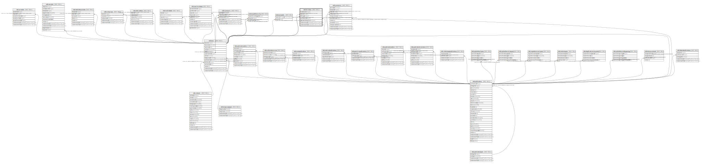

# ndb.formtaxa

## Description

## Columns

| # | Name                  | Type                           | Default                                           | Nullable | Children | Parents                                 | Comment |
| - | --------------------- | ------------------------------ | ------------------------------------------------- | -------- | -------- | --------------------------------------- | ------- |
| 1 | formtaxonid           | integer                        | nextval('ndb.seq_formtaxa_formtaxonid'::regclass) | false    |          |                                         |         |
| 2 | taxonid               | integer                        |                                                   | false    |          | [ndb.taxa](ndb.taxa.md)                 |         |
| 3 | affinityid            | integer                        |                                                   | false    |          | [ndb.taxa](ndb.taxa.md)                 |         |
| 4 | publicationid         | integer                        |                                                   | false    |          | [ndb.publications](ndb.publications.md) |         |
| 5 | systematicdescription | boolean                        |                                                   | false    |          |                                         |         |
| 6 | recdatecreated        | timestamp(0) without time zone | timezone('UTC'::text, now())                      | false    |          |                                         |         |
| 7 | recdatemodified       | timestamp(0) without time zone |                                                   | false    |          |                                         |         |

## Viewpoints

| Name                               | Definition                                             |
| ---------------------------------- | ------------------------------------------------------ |
| [Taxonomic Tables](viewpoint-2.md) | Tables related to species, observations and specimens. |

## Constraints

| # | Name                     | Type        | Definition                                                                                                 |
| - | ------------------------ | ----------- | ---------------------------------------------------------------------------------------------------------- |
| 1 | formtaxa_pkey            | PRIMARY KEY | PRIMARY KEY (formtaxonid)                                                                                  |
| 2 | fk_formtaxa_publications | FOREIGN KEY | FOREIGN KEY (publicationid) REFERENCES ndb.publications(publicationid) ON UPDATE CASCADE ON DELETE CASCADE |
| 3 | fk_formtaxa_taxa         | FOREIGN KEY | FOREIGN KEY (taxonid) REFERENCES ndb.taxa(taxonid)                                                         |
| 4 | fk_formtaxa_taxa1        | FOREIGN KEY | FOREIGN KEY (affinityid) REFERENCES ndb.taxa(taxonid) ON UPDATE CASCADE ON DELETE CASCADE                  |

## Indexes

| # | Name          | Definition                                                                  |
| - | ------------- | --------------------------------------------------------------------------- |
| 1 | formtaxa_pkey | CREATE UNIQUE INDEX formtaxa_pkey ON ndb.formtaxa USING btree (formtaxonid) |

## Triggers

| # | Name                | Definition                                                                                                                            |
| - | ------------------- | ------------------------------------------------------------------------------------------------------------------------------------- |
| 1 | tr_sites_modifydate | CREATE TRIGGER tr_sites_modifydate BEFORE INSERT OR UPDATE ON ndb.formtaxa FOR EACH ROW EXECUTE FUNCTION ndb.update_recdatemodified() |

## Relations

---

> Generated by [tbls](https://github.com/k1LoW/tbls)