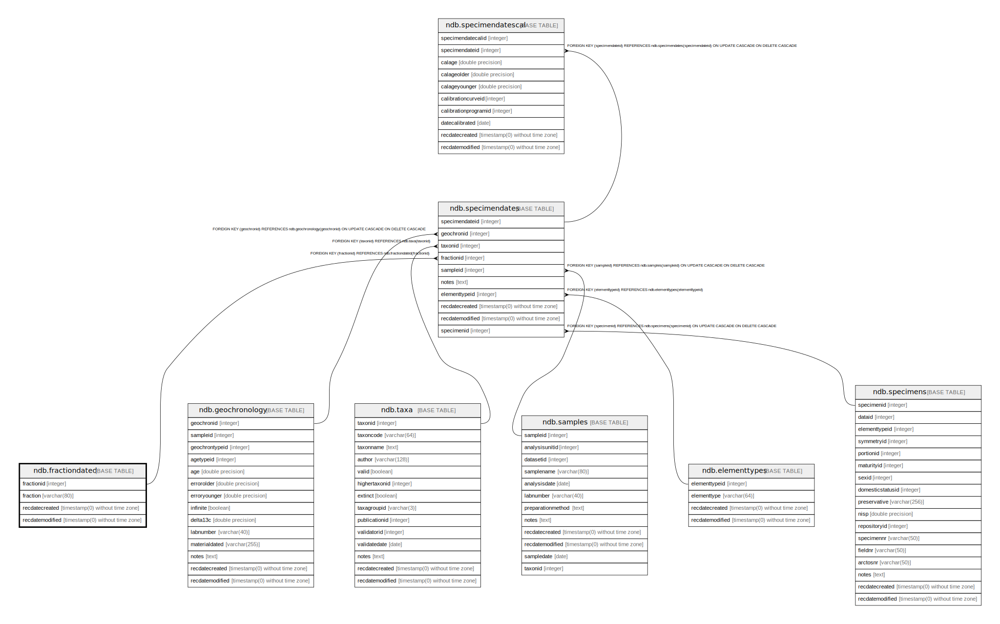

# ndb.fractiondated

## Description

## Columns

| # | Name            | Type                           | Default                                               | Nullable | Children                                  | Parents | Comment |
| - | --------------- | ------------------------------ | ----------------------------------------------------- | -------- | ----------------------------------------- | ------- | ------- |
| 1 | fraction        | varchar(80)                    |                                                       | false    |                                           |         |         |
| 2 | fractionid      | integer                        | nextval('ndb.seq_fractiondated_fractionid'::regclass) | false    | [ndb.specimendates](ndb.specimendates.md) |         |         |
| 3 | recdatecreated  | timestamp(0) without time zone | timezone('UTC'::text, now())                          | false    |                                           |         |         |
| 4 | recdatemodified | timestamp(0) without time zone |                                                       | false    |                                           |         |         |

## Constraints

| # | Name               | Type        | Definition               |
| - | ------------------ | ----------- | ------------------------ |
| 1 | fractiondated_pkey | PRIMARY KEY | PRIMARY KEY (fractionid) |

## Indexes

| # | Name               | Definition                                                                           |
| - | ------------------ | ------------------------------------------------------------------------------------ |
| 1 | fractiondated_pkey | CREATE UNIQUE INDEX fractiondated_pkey ON ndb.fractiondated USING btree (fractionid) |

## Triggers

| # | Name                | Definition                                                                                                                                 |
| - | ------------------- | ------------------------------------------------------------------------------------------------------------------------------------------ |
| 1 | tr_sites_modifydate | CREATE TRIGGER tr_sites_modifydate BEFORE INSERT OR UPDATE ON ndb.fractiondated FOR EACH ROW EXECUTE FUNCTION ndb.update_recdatemodified() |

## Relations

---

> Generated by [tbls](https://github.com/k1LoW/tbls)