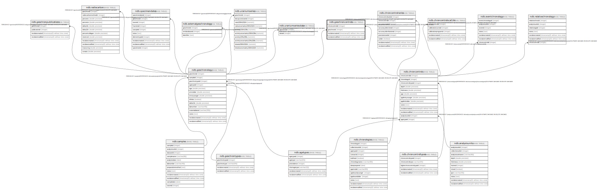

# ndb.geochroncontrols

## Description

## Columns

| # | Name            | Type                           | Default                      | Nullable | Children | Parents                                   | Comment |
| - | --------------- | ------------------------------ | ---------------------------- | -------- | -------- | ----------------------------------------- | ------- |
| 1 | chroncontrolid  | integer                        |                              | false    |          | [ndb.chroncontrols](ndb.chroncontrols.md) |         |
| 2 | geochronid      | integer                        |                              | false    |          | [ndb.geochronology](ndb.geochronology.md) |         |
| 3 | recdatecreated  | timestamp(0) without time zone | timezone('UTC'::text, now()) | false    |          |                                           |         |
| 4 | recdatemodified | timestamp(0) without time zone |                              | false    |          |                                           |         |

## Constraints

| # | Name                              | Type        | Definition                                                                                                    |
| - | --------------------------------- | ----------- | ------------------------------------------------------------------------------------------------------------- |
| 1 | fk_geochroncontrols_chroncontrols | FOREIGN KEY | FOREIGN KEY (chroncontrolid) REFERENCES ndb.chroncontrols(chroncontrolid) ON UPDATE CASCADE ON DELETE CASCADE |
| 2 | geochroncontrols_pkey             | PRIMARY KEY | PRIMARY KEY (chroncontrolid, geochronid)                                                                      |
| 3 | fk_geochroncontrols_geochronology | FOREIGN KEY | FOREIGN KEY (geochronid) REFERENCES ndb.geochronology(geochronid) ON UPDATE CASCADE ON DELETE CASCADE         |

## Indexes

| # | Name                               | Definition                                                                                                                  |
| - | ---------------------------------- | --------------------------------------------------------------------------------------------------------------------------- |
| 1 | geochroncontrols_pkey              | CREATE UNIQUE INDEX geochroncontrols_pkey ON ndb.geochroncontrols USING btree (chroncontrolid, geochronid)                  |
| 2 | ix_chroncontrolid_geochroncontrols | CREATE INDEX ix_chroncontrolid_geochroncontrols ON ndb.geochroncontrols USING btree (chroncontrolid) WITH (fillfactor='10') |
| 3 | ix_geochronid_geochroncontrols     | CREATE INDEX ix_geochronid_geochroncontrols ON ndb.geochroncontrols USING btree (geochronid) WITH (fillfactor='10')         |

## Triggers

| # | Name                | Definition                                                                                                                                    |
| - | ------------------- | --------------------------------------------------------------------------------------------------------------------------------------------- |
| 1 | tr_sites_modifydate | CREATE TRIGGER tr_sites_modifydate BEFORE INSERT OR UPDATE ON ndb.geochroncontrols FOR EACH ROW EXECUTE FUNCTION ndb.update_recdatemodified() |

## Relations

---

> Generated by [tbls](https://github.com/k1LoW/tbls)