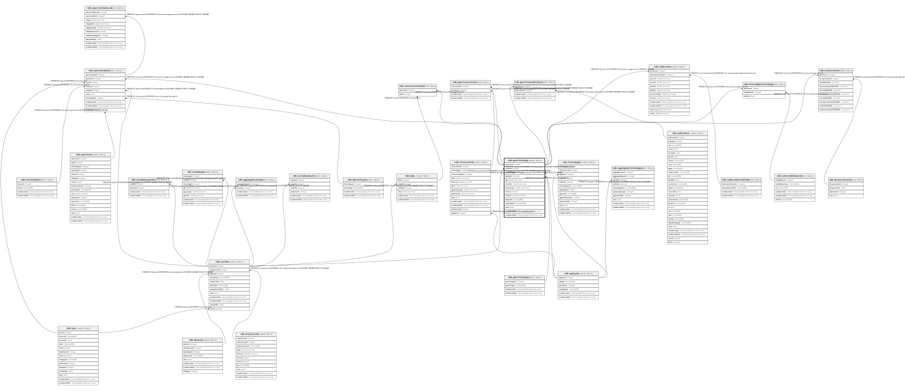

# ndb.geochronology

## Description

This table stores geochronologic data. Geochronologic measurements are from geochronologic samples, which are from Analysis Units, which may have a depth and thickness. Geochronologic measurements may be from the same or different Analysis Units as fossils. In the case of faunal excavations, geochronologic samples are typically from the same Analysis Units as the fossils, and there may be multiple geochronologic samples from a single Analysis Unit. In the case of cores used for microfossil analysis, geochronologic samples are often from separate Analysis Units; dated core sections are often thicker than microfossil Analysis Units.

## Columns

| #  | Name            | Type                           | Default                                               | Nullable | Children                                                                                                                                                                                                                                                                                                                                      | Parents                                   | Comment                                                                                                                                                                                                                                   |
| -- | --------------- | ------------------------------ | ----------------------------------------------------- | -------- | --------------------------------------------------------------------------------------------------------------------------------------------------------------------------------------------------------------------------------------------------------------------------------------------------------------------------------------------- | ----------------------------------------- | ----------------------------------------------------------------------------------------------------------------------------------------------------------------------------------------------------------------------------------------- |
| 1  | age             | double precision               |                                                       | true     |                                                                                                                                                                                                                                                                                                                                               |                                           | Reported age value of the geochronologic measurement.                                                                                                                                                                                     |
| 2  | agetypeid       | integer                        |                                                       | false    |                                                                                                                                                                                                                                                                                                                                               | [ndb.agetypes](ndb.agetypes.md)           | Identification number for the age units, e.g. «Radiocarbon years BP», «Calibrated radiocarbon years BP».                                                                                                                                  |
| 3  | delta13c        | double precision               |                                                       | true     |                                                                                                                                                                                                                                                                                                                                               |                                           | The measured or assumed δ13C value for radiocarbon dates, if provided. Radiocarbon dates are assumed to be normalized to δ13C, and if uncorrected and normalized ages are reported, the normalized age should be entered in the database. |
| 4  | errorolder      | double precision               |                                                       | true     |                                                                                                                                                                                                                                                                                                                                               |                                           | The older error limit of the age value. For a date reported with ±1 SD or σ, the ErrorOlder and ErrorYounger values are this value.                                                                                                       |
| 5  | erroryounger    | double precision               |                                                       | true     |                                                                                                                                                                                                                                                                                                                                               |                                           | The younger error limit of the age value.                                                                                                                                                                                                 |
| 6  | geochronid      | integer                        | nextval('ndb.seq_geochronology_geochronid'::regclass) | false    | [ndb.externalgeochronology](ndb.externalgeochronology.md) [ndb.geochroncontrols](ndb.geochroncontrols.md) [ndb.geochronpublications](ndb.geochronpublications.md) [ndb.radiocarbon](ndb.radiocarbon.md) [ndb.specimendates](ndb.specimendates.md) [ndb.uraniumseries](ndb.uraniumseries.md) [ndb.uraniumseriesdata](ndb.uraniumseriesdata.md) |                                           | An arbitrary Geochronologic identification number.                                                                                                                                                                                        |
| 7  | geochrontypeid  | integer                        |                                                       | false    |                                                                                                                                                                                                                                                                                                                                               | [ndb.geochrontypes](ndb.geochrontypes.md) | Identification number for the type of Geochronologic analysis, e.g. «Carbon-14», «Thermoluminescence». Field links to the GeochronTypes table.                                                                                            |
| 8  | infinite        | boolean                        |                                                       | false    |                                                                                                                                                                                                                                                                                                                                               |                                           | Is «True» for and infinite or “greater than” geochronologic measurement, otherwise is «False».                                                                                                                                            |
| 9  | labnumber       | varchar(40)                    |                                                       | true     |                                                                                                                                                                                                                                                                                                                                               |                                           | Lab number for the geochronologic measurement.                                                                                                                                                                                            |
| 10 | materialdated   | varchar(255)                   |                                                       | true     |                                                                                                                                                                                                                                                                                                                                               |                                           | Material analyzed for a geochronologic measurement.                                                                                                                                                                                       |
| 11 | notes           | text                           |                                                       | true     |                                                                                                                                                                                                                                                                                                                                               |                                           | Free form notes or comments about the geochronologic measurement.                                                                                                                                                                         |
| 12 | recdatecreated  | timestamp(0) without time zone | timezone('UTC'::text, now())                          | false    |                                                                                                                                                                                                                                                                                                                                               |                                           |                                                                                                                                                                                                                                           |
| 13 | recdatemodified | timestamp(0) without time zone |                                                       | false    |                                                                                                                                                                                                                                                                                                                                               |                                           |                                                                                                                                                                                                                                           |
| 14 | sampleid        | integer                        |                                                       | false    |                                                                                                                                                                                                                                                                                                                                               | [ndb.samples](ndb.samples.md)             | Sample identification number. Field links to Samples table.                                                                                                                                                                               |

## Viewpoints

| Name                                        | Definition                                        |
| ------------------------------------------- | ------------------------------------------------- |
| [Chronology related tables](viewpoint-5.md) | Tables related to chronology and age assignments. |

## Constraints

| # | Name                           | Type        | Definition                                                                                                    |
| - | ------------------------------ | ----------- | ------------------------------------------------------------------------------------------------------------- |
| 1 | fk_geochronology_agetypes      | FOREIGN KEY | FOREIGN KEY (agetypeid) REFERENCES ndb.agetypes(agetypeid)                                                    |
| 2 | fk_geochronology_geochrontypes | FOREIGN KEY | FOREIGN KEY (geochrontypeid) REFERENCES ndb.geochrontypes(geochrontypeid) ON UPDATE CASCADE ON DELETE CASCADE |
| 3 | fk_geochronology_samples       | FOREIGN KEY | FOREIGN KEY (sampleid) REFERENCES ndb.samples(sampleid) ON UPDATE CASCADE ON DELETE CASCADE                   |
| 4 | geochronology_pkey             | PRIMARY KEY | PRIMARY KEY (geochronid)                                                                                      |
| 5 | geochronology_unique           | UNIQUE      | UNIQUE (sampleid, labnumber)                                                                                  |

## Indexes

| # | Name                        | Definition                                                                                                |
| - | --------------------------- | --------------------------------------------------------------------------------------------------------- |
| 1 | geoage_idx                  | CREATE INDEX geoage_idx ON ndb.geochronology USING btree (age)                                            |
| 2 | geochronology_labnumber_idx | CREATE INDEX geochronology_labnumber_idx ON ndb.geochronology USING btree (labnumber)                     |
| 3 | geochronology_pkey          | CREATE UNIQUE INDEX geochronology_pkey ON ndb.geochronology USING btree (geochronid)                      |
| 4 | geochronology_unique        | CREATE UNIQUE INDEX geochronology_unique ON ndb.geochronology USING btree (sampleid, labnumber)           |
| 5 | ix_sampleid_geochronology   | CREATE INDEX ix_sampleid_geochronology ON ndb.geochronology USING btree (sampleid) WITH (fillfactor='10') |

## Triggers

| # | Name                | Definition                                                                                                                                 |
| - | ------------------- | ------------------------------------------------------------------------------------------------------------------------------------------ |
| 1 | tr_sites_modifydate | CREATE TRIGGER tr_sites_modifydate BEFORE INSERT OR UPDATE ON ndb.geochronology FOR EACH ROW EXECUTE FUNCTION ndb.update_recdatemodified() |

## Relations

---

> Generated by [tbls](https://github.com/k1LoW/tbls)