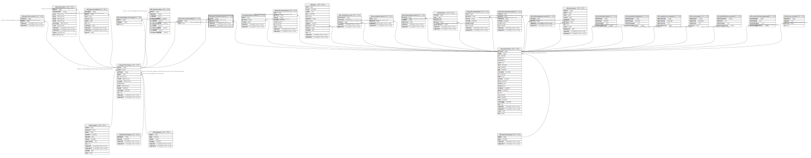

# ndb.geochronpublications

## Description

Publications in which Geochronologic measurements are reported. Many older radiocarbon dates are reported in the journal Radiocarbon. Dates may be reported in multiple publications. The “publication” could be a database such as the online Canadian Archaeological Radiocarbon Database.

## Columns

| # | Name            | Type                           | Default                      | Nullable | Children | Parents                                   | Comment                                                                       |
| - | --------------- | ------------------------------ | ---------------------------- | -------- | -------- | ----------------------------------------- | ----------------------------------------------------------------------------- |
| 1 | geochronid      | integer                        |                              | false    |          | [ndb.geochronology](ndb.geochronology.md) | Geochronologic identification number. Field links to the Geochronology table. |
| 2 | publicationid   | integer                        |                              | false    |          | [ndb.publications](ndb.publications.md)   | Publication identification number. Field links to the Publications table.     |
| 3 | recdatecreated  | timestamp(0) without time zone | timezone('UTC'::text, now()) | false    |          |                                           |                                                                               |
| 4 | recdatemodified | timestamp(0) without time zone |                              | false    |          |                                           |                                                                               |

## Constraints

| # | Name                                  | Type        | Definition                                                                                                 |
| - | ------------------------------------- | ----------- | ---------------------------------------------------------------------------------------------------------- |
| 1 | fk_geochronpublications_geochronology | FOREIGN KEY | FOREIGN KEY (geochronid) REFERENCES ndb.geochronology(geochronid) ON UPDATE CASCADE ON DELETE CASCADE      |
| 2 | geochronpublications_pkey             | PRIMARY KEY | PRIMARY KEY (geochronid, publicationid)                                                                    |
| 3 | fk_geochronpublications_publications  | FOREIGN KEY | FOREIGN KEY (publicationid) REFERENCES ndb.publications(publicationid) ON UPDATE CASCADE ON DELETE CASCADE |

## Indexes

| # | Name                                  | Definition                                                                                                                        |
| - | ------------------------------------- | --------------------------------------------------------------------------------------------------------------------------------- |
| 1 | geochronpublications_pkey             | CREATE UNIQUE INDEX geochronpublications_pkey ON ndb.geochronpublications USING btree (geochronid, publicationid)                 |
| 2 | ix_geochronid_geochronpublications    | CREATE INDEX ix_geochronid_geochronpublications ON ndb.geochronpublications USING btree (geochronid) WITH (fillfactor='10')       |
| 3 | ix_publicationid_geochronpublications | CREATE INDEX ix_publicationid_geochronpublications ON ndb.geochronpublications USING btree (publicationid) WITH (fillfactor='10') |

## Triggers

| # | Name                | Definition                                                                                                                                        |
| - | ------------------- | ------------------------------------------------------------------------------------------------------------------------------------------------- |
| 1 | tr_sites_modifydate | CREATE TRIGGER tr_sites_modifydate BEFORE INSERT OR UPDATE ON ndb.geochronpublications FOR EACH ROW EXECUTE FUNCTION ndb.update_recdatemodified() |

## Relations

---

> Generated by [tbls](https://github.com/k1LoW/tbls)