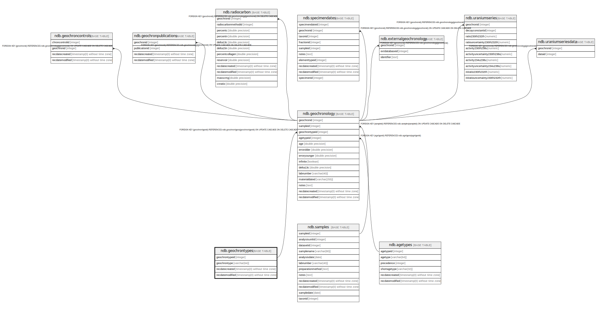

# ndb.geochrontypes

## Description

Lookup table for Geochronology Types. Table is referenced by the Geochronology table.

## Columns

| # | Name            | Type                           | Default                                                   | Nullable | Children                                  | Parents | Comment                                   |
| - | --------------- | ------------------------------ | --------------------------------------------------------- | -------- | ----------------------------------------- | ------- | ----------------------------------------- |
| 1 | geochrontypeid  | integer                        | nextval('ndb.seq_geochrontypes_geochrontypeid'::regclass) | false    | [ndb.geochronology](ndb.geochronology.md) |         | Geochronology Type identification number. |
| 2 | geochrontype    | varchar(64)                    |                                                           | false    |                                           |         | Type of Geochronologic measurement.       |
| 3 | recdatecreated  | timestamp(0) without time zone | timezone('UTC'::text, now())                              | false    |                                           |         |                                           |
| 4 | recdatemodified | timestamp(0) without time zone |                                                           | false    |                                           |         |                                           |

## Constraints

| # | Name               | Type        | Definition                   |
| - | ------------------ | ----------- | ---------------------------- |
| 1 | geochrontypes_pkey | PRIMARY KEY | PRIMARY KEY (geochrontypeid) |

## Indexes

| # | Name               | Definition                                                                               |
| - | ------------------ | ---------------------------------------------------------------------------------------- |
| 1 | geochrontypes_pkey | CREATE UNIQUE INDEX geochrontypes_pkey ON ndb.geochrontypes USING btree (geochrontypeid) |

## Triggers

| # | Name                | Definition                                                                                                                                 |
| - | ------------------- | ------------------------------------------------------------------------------------------------------------------------------------------ |
| 1 | tr_sites_modifydate | CREATE TRIGGER tr_sites_modifydate BEFORE INSERT OR UPDATE ON ndb.geochrontypes FOR EACH ROW EXECUTE FUNCTION ndb.update_recdatemodified() |

## Relations

---

> Generated by [tbls](https://github.com/k1LoW/tbls)