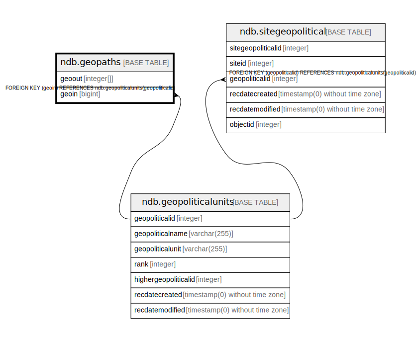

# ndb.geopaths

## Description

## Columns

| # | Name   | Type      | Default | Nullable | Children | Parents                                           | Comment |
| - | ------ | --------- | ------- | -------- | -------- | ------------------------------------------------- | ------- |
| 1 | geoin  | bigint    |         | false    |          | [ndb.geopoliticalunits](ndb.geopoliticalunits.md) |         |
| 2 | geoout | integer[] |         | false    |          |                                                   |         |

## Constraints

| # | Name                | Type        | Definition                                                           |
| - | ------------------- | ----------- | -------------------------------------------------------------------- |
| 1 | geopaths_geoin_fkey | FOREIGN KEY | FOREIGN KEY (geoin) REFERENCES ndb.geopoliticalunits(geopoliticalid) |
| 2 | geopaths_pkey       | PRIMARY KEY | PRIMARY KEY (geoout, geoin)                                          |

## Indexes

| # | Name          | Definition                                                                    |
| - | ------------- | ----------------------------------------------------------------------------- |
| 1 | geopaths_pkey | CREATE UNIQUE INDEX geopaths_pkey ON ndb.geopaths USING btree (geoout, geoin) |

## Relations

---

> Generated by [tbls](https://github.com/k1LoW/tbls)