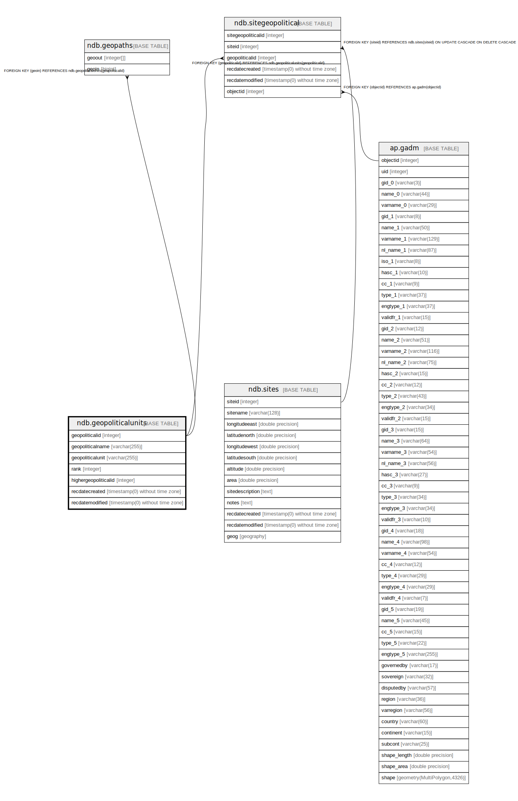

# ndb.geopoliticalunits

## Description

Lookup table of GeoPoliticalUnits. Table is referenced by the SiteGeoPolitical table. These are countries and various subdivisions. Countries and subdivisions were acquired from the U.S. Central Intelligence Agency World Factbook8 and the ISO 3166-1 and ISO 3166-2 databases9.  
Each GeoPolitical Unit has a rank. GeoPolitical Units with Rank 1 are generally countries. There are a few exceptions, including Antarctica and island territories, such as Greenland, which although a Danish territory, is geographically separate and distinct. Rank 2 units are generally secondary political divisions with various designations: e.g. states in the United States, provinces in Canada, and regions in France. For some countries, the secondary divisions are not political but rather distinct geographic entities, such as islands. The secondary divisions of some island nations include either groups of islands or sections of more highly populated islands; however, the actual island on which a site is located is more important information. Some countries also have Rank 3 units, e.g. counties in the United States and metropolitan departments in France. In addition to purely political units, various other administrative regions and geographic entities can be contained in this table. Examples of administrative regions are National Parks and Forests. It might be quite useful, for example, to have a record of all the sites in Yellowstone National Park. These additional units are Rank 4, and they can be added to the database as warranted.

## Columns

| # | Name                 | Type                           | Default                                                       | Nullable | Children                                                                        | Parents | Comment                                                                         |
| - | -------------------- | ------------------------------ | ------------------------------------------------------------- | -------- | ------------------------------------------------------------------------------- | ------- | ------------------------------------------------------------------------------- |
| 1 | geopoliticalid       | integer                        | nextval('ndb.seq_geopoliticalunits_geopoliticalid'::regclass) | false    | [ndb.geopaths](ndb.geopaths.md) [ndb.sitegeopolitical](ndb.sitegeopolitical.md) |         | An arbitrary GeoPolitical identification number.                                |
| 2 | geopoliticalname     | varchar(255)                   |                                                               | false    |                                                                                 |         | Name of the GeoPolitical Unit, e.g. Canada, Saskatchewan.                       |
| 3 | geopoliticalunit     | varchar(255)                   |                                                               | true     |                                                                                 |         | The name of the unit, e.g. country, state, county, island, governorate, oblast. |
| 4 | highergeopoliticalid | integer                        |                                                               | false    |                                                                                 |         | The GeoPoliticalUnit with higher rank, e.g. the country in which a state lies.  |
| 5 | rank                 | integer                        |                                                               | false    |                                                                                 |         | The rank of the unit.                                                           |
| 6 | recdatecreated       | timestamp(0) without time zone | timezone('UTC'::text, now())                                  | false    |                                                                                 |         |                                                                                 |
| 7 | recdatemodified      | timestamp(0) without time zone |                                                               | false    |                                                                                 |         |                                                                                 |

## Constraints

| # | Name                   | Type        | Definition                   |
| - | ---------------------- | ----------- | ---------------------------- |
| 1 | geopoliticalunits_pkey | PRIMARY KEY | PRIMARY KEY (geopoliticalid) |

## Indexes

| # | Name                                  | Definition                                                                                                                        |
| - | ------------------------------------- | --------------------------------------------------------------------------------------------------------------------------------- |
| 1 | geopoliticalunits_pkey                | CREATE UNIQUE INDEX geopoliticalunits_pkey ON ndb.geopoliticalunits USING btree (geopoliticalid)                                  |
| 2 | ix_geopoliticalname_geopoliticalunits | CREATE INDEX ix_geopoliticalname_geopoliticalunits ON ndb.geopoliticalunits USING btree (geopoliticalname) WITH (fillfactor='10') |
| 3 | ix_rank_geopoliticalunits             | CREATE INDEX ix_rank_geopoliticalunits ON ndb.geopoliticalunits USING btree (rank) WITH (fillfactor='10')                         |

## Triggers

| # | Name                | Definition                                                                                                                                     |
| - | ------------------- | ---------------------------------------------------------------------------------------------------------------------------------------------- |
| 1 | tr_sites_modifydate | CREATE TRIGGER tr_sites_modifydate BEFORE INSERT OR UPDATE ON ndb.geopoliticalunits FOR EACH ROW EXECUTE FUNCTION ndb.update_recdatemodified() |

## Relations

---

> Generated by [tbls](https://github.com/k1LoW/tbls)