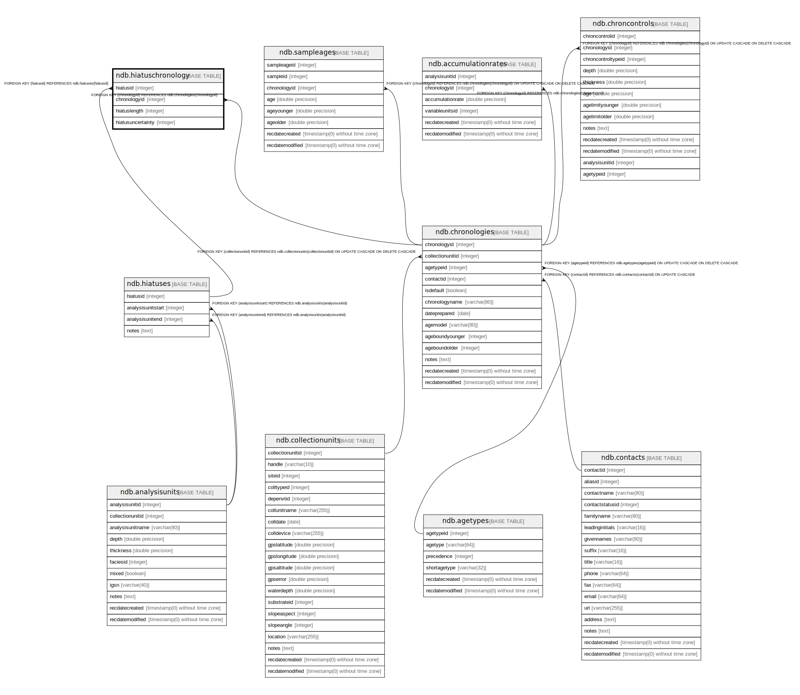

# ndb.hiatuschronology

## Description

## Columns

| # | Name              | Type    | Default | Nullable | Children | Parents                                 | Comment |
| - | ----------------- | ------- | ------- | -------- | -------- | --------------------------------------- | ------- |
| 1 | chronologyid      | integer |         | true     |          | [ndb.chronologies](ndb.chronologies.md) |         |
| 2 | hiatusid          | integer |         | true     |          | [ndb.hiatuses](ndb.hiatuses.md)         |         |
| 3 | hiatuslength      | integer |         | true     |          |                                         |         |
| 4 | hiatusuncertainty | integer |         | true     |          |                                         |         |

## Viewpoints

| Name                                        | Definition                                        |
| ------------------------------------------- | ------------------------------------------------- |
| [Chronology related tables](viewpoint-5.md) | Tables related to chronology and age assignments. |

## Constraints

| # | Name                                       | Type        | Definition                                                           |
| - | ------------------------------------------ | ----------- | -------------------------------------------------------------------- |
| 1 | hiatuschronology_chronologyid_fkey         | FOREIGN KEY | FOREIGN KEY (chronologyid) REFERENCES ndb.chronologies(chronologyid) |
| 2 | hiatuschronology_hiatusid_chronologyid_key | UNIQUE      | UNIQUE (hiatusid, chronologyid)                                      |
| 3 | hiatuschronology_hiatusid_fkey             | FOREIGN KEY | FOREIGN KEY (hiatusid) REFERENCES ndb.hiatuses(hiatusid)             |
| 4 | hiatuschronology_hiatuslength_check        | CHECK       | CHECK ((hiatuslength >= 0))                                          |

## Indexes

| # | Name                                       | Definition                                                                                                                  |
| - | ------------------------------------------ | --------------------------------------------------------------------------------------------------------------------------- |
| 1 | hiatuschronology_hiatusid_chronologyid_key | CREATE UNIQUE INDEX hiatuschronology_hiatusid_chronologyid_key ON ndb.hiatuschronology USING btree (hiatusid, chronologyid) |

## Relations

---

> Generated by [tbls](https://github.com/k1LoW/tbls)