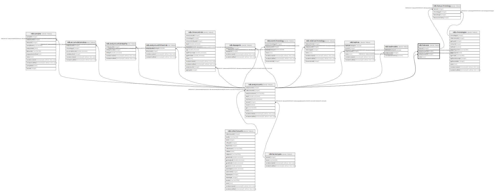

# ndb.hiatuses

## Description

## Columns

| # | Name              | Type    | Default                                        | Nullable | Children                                        | Parents                                   | Comment |
| - | ----------------- | ------- | ---------------------------------------------- | -------- | ----------------------------------------------- | ----------------------------------------- | ------- |
| 1 | hiatusid          | integer | nextval('ndb.hiatuses_hiatusid_seq'::regclass) | false    | [ndb.hiatuschronology](ndb.hiatuschronology.md) |                                           |         |
| 2 | analysisunitstart | integer |                                                | true     |                                                 | [ndb.analysisunits](ndb.analysisunits.md) |         |
| 3 | analysisunitend   | integer |                                                | true     |                                                 | [ndb.analysisunits](ndb.analysisunits.md) |         |
| 4 | notes             | text    |                                                | true     |                                                 |                                           |         |

## Constraints

| # | Name                                                    | Type        | Definition                                                                   |
| - | ------------------------------------------------------- | ----------- | ---------------------------------------------------------------------------- |
| 1 | hiatuses_analysisunitend_fkey                           | FOREIGN KEY | FOREIGN KEY (analysisunitend) REFERENCES ndb.analysisunits(analysisunitid)   |
| 2 | hiatuses_analysisunitstart_fkey                         | FOREIGN KEY | FOREIGN KEY (analysisunitstart) REFERENCES ndb.analysisunits(analysisunitid) |
| 3 | hiatuses_pkey                                           | PRIMARY KEY | PRIMARY KEY (hiatusid)                                                       |
| 4 | hiatuses_hiatusid_analysisunitstart_analysisunitend_key | UNIQUE      | UNIQUE (hiatusid, analysisunitstart, analysisunitend)                        |

## Indexes

| # | Name                                                    | Definition                                                                                                                                             |
| - | ------------------------------------------------------- | ------------------------------------------------------------------------------------------------------------------------------------------------------ |
| 1 | hiatuses_pkey                                           | CREATE UNIQUE INDEX hiatuses_pkey ON ndb.hiatuses USING btree (hiatusid)                                                                               |
| 2 | hiatuses_hiatusid_analysisunitstart_analysisunitend_key | CREATE UNIQUE INDEX hiatuses_hiatusid_analysisunitstart_analysisunitend_key ON ndb.hiatuses USING btree (hiatusid, analysisunitstart, analysisunitend) |

## Relations

---

> Generated by [tbls](https://github.com/k1LoW/tbls)