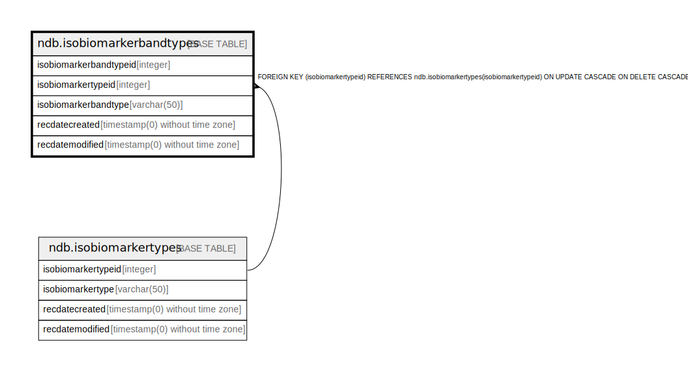

# ndb.isobiomarkerbandtypes

## Description

## Columns

| # | Name                   | Type                           | Default                                                                   | Nullable | Children | Parents                                           | Comment |
| - | ---------------------- | ------------------------------ | ------------------------------------------------------------------------- | -------- | -------- | ------------------------------------------------- | ------- |
| 1 | isobiomarkerbandtype   | varchar(50)                    |                                                                           | false    |          |                                                   |         |
| 2 | isobiomarkerbandtypeid | integer                        | nextval('ndb.seq_isobiomarkerbandtypes_isobiomarkerbandtypeid'::regclass) | false    |          |                                                   |         |
| 3 | isobiomarkertypeid     | integer                        |                                                                           | false    |          | [ndb.isobiomarkertypes](ndb.isobiomarkertypes.md) |         |
| 4 | recdatecreated         | timestamp(0) without time zone | timezone('UTC'::text, now())                                              | false    |          |                                                   |         |
| 5 | recdatemodified        | timestamp(0) without time zone |                                                                           | false    |          |                                                   |         |

## Viewpoints

| Name                                      | Definition                           |
| ----------------------------------------- | ------------------------------------ |
| [Controlled Vocabularies](viewpoint-0.md) | Tables with controlled vocabularies. |

## Constraints

| # | Name                                   | Type        | Definition                                                                                                                |
| - | -------------------------------------- | ----------- | ------------------------------------------------------------------------------------------------------------------------- |
| 1 | fk_isobiomarkerbands_isobiomarkertypes | FOREIGN KEY | FOREIGN KEY (isobiomarkertypeid) REFERENCES ndb.isobiomarkertypes(isobiomarkertypeid) ON UPDATE CASCADE ON DELETE CASCADE |
| 2 | isobiomarkerbandtypes_pkey             | PRIMARY KEY | PRIMARY KEY (isobiomarkerbandtypeid)                                                                                      |

## Indexes

| # | Name                       | Definition                                                                                                       |
| - | -------------------------- | ---------------------------------------------------------------------------------------------------------------- |
| 1 | isobiomarkerbandtypes_pkey | CREATE UNIQUE INDEX isobiomarkerbandtypes_pkey ON ndb.isobiomarkerbandtypes USING btree (isobiomarkerbandtypeid) |

## Triggers

| # | Name                | Definition                                                                                                                                         |
| - | ------------------- | -------------------------------------------------------------------------------------------------------------------------------------------------- |
| 1 | tr_sites_modifydate | CREATE TRIGGER tr_sites_modifydate BEFORE INSERT OR UPDATE ON ndb.isobiomarkerbandtypes FOR EACH ROW EXECUTE FUNCTION ndb.update_recdatemodified() |

## Relations

---

> Generated by [tbls](https://github.com/k1LoW/tbls)