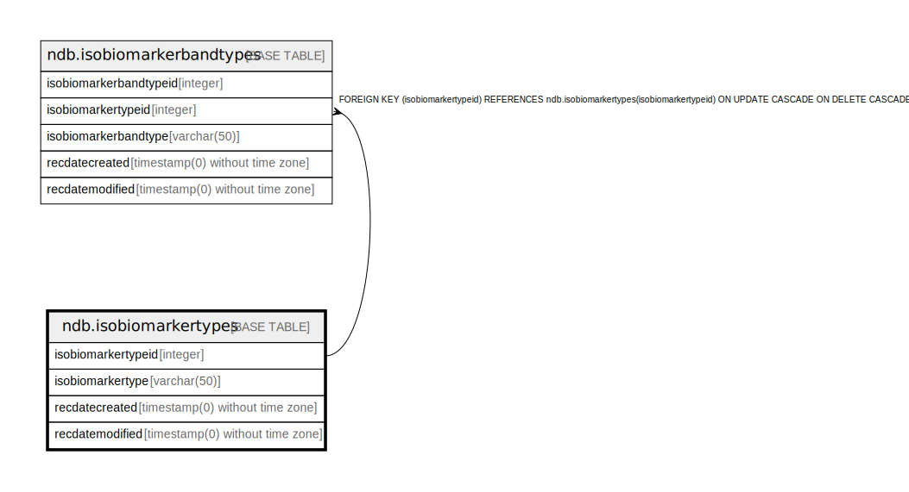

# ndb.isobiomarkertypes

## Description

## Columns

| # | Name               | Type                           | Default                                                           | Nullable | Children                                                  | Parents | Comment |
| - | ------------------ | ------------------------------ | ----------------------------------------------------------------- | -------- | --------------------------------------------------------- | ------- | ------- |
| 1 | isobiomarkertypeid | integer                        | nextval('ndb.seq_isobiomarkertypes_isobiomarkertypeid'::regclass) | false    | [ndb.isobiomarkerbandtypes](ndb.isobiomarkerbandtypes.md) |         |         |
| 2 | isobiomarkertype   | varchar(50)                    |                                                                   | false    |                                                           |         |         |
| 3 | recdatecreated     | timestamp(0) without time zone | timezone('UTC'::text, now())                                      | false    |                                                           |         |         |
| 4 | recdatemodified    | timestamp(0) without time zone |                                                                   | false    |                                                           |         |         |

## Viewpoints

| Name                                      | Definition                           |
| ----------------------------------------- | ------------------------------------ |
| [Controlled Vocabularies](viewpoint-0.md) | Tables with controlled vocabularies. |

## Constraints

| # | Name                   | Type        | Definition                       |
| - | ---------------------- | ----------- | -------------------------------- |
| 1 | isobiomarkertypes_pkey | PRIMARY KEY | PRIMARY KEY (isobiomarkertypeid) |

## Indexes

| # | Name                   | Definition                                                                                           |
| - | ---------------------- | ---------------------------------------------------------------------------------------------------- |
| 1 | isobiomarkertypes_pkey | CREATE UNIQUE INDEX isobiomarkertypes_pkey ON ndb.isobiomarkertypes USING btree (isobiomarkertypeid) |

## Triggers

| # | Name                | Definition                                                                                                                                     |
| - | ------------------- | ---------------------------------------------------------------------------------------------------------------------------------------------- |
| 1 | tr_sites_modifydate | CREATE TRIGGER tr_sites_modifydate BEFORE INSERT OR UPDATE ON ndb.isobiomarkertypes FOR EACH ROW EXECUTE FUNCTION ndb.update_recdatemodified() |

## Relations

---

> Generated by [tbls](https://github.com/k1LoW/tbls)