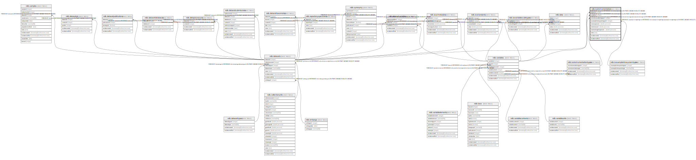

# ndb.isoinstrumentation

## Description

## Columns

| #  | Name                       | Type                           | Default                      | Nullable | Children | Parents                                                           | Comment |
| -- | -------------------------- | ------------------------------ | ---------------------------- | -------- | -------- | ----------------------------------------------------------------- | ------- |
| 1  | datasetid                  | integer                        |                              | false    |          | [ndb.datasets](ndb.datasets.md)                                   |         |
| 2  | variableid                 | integer                        |                              | false    |          | [ndb.variables](ndb.variables.md)                                 |         |
| 3  | isoinstrumentationtypeid   | integer                        |                              | true     |          | [ndb.isoinstrumentationtypes](ndb.isoinstrumentationtypes.md)     |         |
| 4  | isosampleintrosystemtypeid | integer                        |                              | true     |          | [ndb.isosampleintrosystemtypes](ndb.isosampleintrosystemtypes.md) |         |
| 5  | insterrorpercent           | double precision               |                              | true     |          |                                                                   |         |
| 6  | insterrorrunsd             | double precision               |                              | true     |          |                                                                   |         |
| 7  | insterrorlongtermpercent   | double precision               |                              | true     |          |                                                                   |         |
| 8  | notes                      | text                           |                              | true     |          |                                                                   |         |
| 9  | recdatecreated             | timestamp(0) without time zone | timezone('UTC'::text, now()) | false    |          |                                                                   |         |
| 10 | recdatemodified            | timestamp(0) without time zone |                              | false    |          |                                                                   |         |

## Constraints

| # | Name                                            | Type        | Definition                                                                                                                                        |
| - | ----------------------------------------------- | ----------- | ------------------------------------------------------------------------------------------------------------------------------------------------- |
| 1 | fk_isoinstrumentation_datasets                  | FOREIGN KEY | FOREIGN KEY (datasetid) REFERENCES ndb.datasets(datasetid) ON UPDATE CASCADE ON DELETE CASCADE                                                    |
| 2 | isoinstrumentation_pkey                         | PRIMARY KEY | PRIMARY KEY (datasetid, variableid)                                                                                                               |
| 3 | fk_isoinstrumentation_isoinstrumentationtypes   | FOREIGN KEY | FOREIGN KEY (isoinstrumentationtypeid) REFERENCES ndb.isoinstrumentationtypes(isoinstrumentationtypeid) ON UPDATE CASCADE ON DELETE CASCADE       |
| 4 | fk_isoinstrumentation_isosampleintrosystemtypes | FOREIGN KEY | FOREIGN KEY (isosampleintrosystemtypeid) REFERENCES ndb.isosampleintrosystemtypes(isosampleintrosystemtypeid) ON UPDATE CASCADE ON DELETE CASCADE |
| 5 | fk_isoinstrumentation_variables                 | FOREIGN KEY | FOREIGN KEY (variableid) REFERENCES ndb.variables(variableid) ON UPDATE CASCADE ON DELETE CASCADE                                                 |

## Indexes

| # | Name                    | Definition                                                                                                |
| - | ----------------------- | --------------------------------------------------------------------------------------------------------- |
| 1 | isoinstrumentation_pkey | CREATE UNIQUE INDEX isoinstrumentation_pkey ON ndb.isoinstrumentation USING btree (datasetid, variableid) |

## Triggers

| # | Name                | Definition                                                                                                                                      |
| - | ------------------- | ----------------------------------------------------------------------------------------------------------------------------------------------- |
| 1 | tr_sites_modifydate | CREATE TRIGGER tr_sites_modifydate BEFORE INSERT OR UPDATE ON ndb.isoinstrumentation FOR EACH ROW EXECUTE FUNCTION ndb.update_recdatemodified() |

## Relations

---

> Generated by [tbls](https://github.com/k1LoW/tbls)