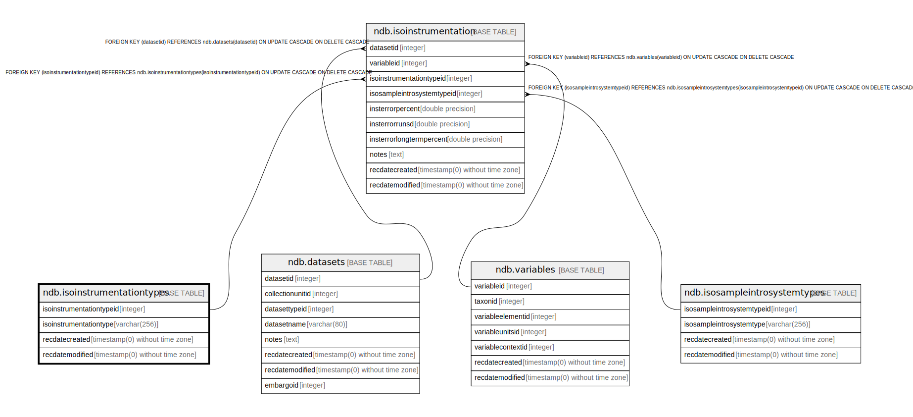

# ndb.isoinstrumentationtypes

## Description

## Columns

| # | Name                     | Type                           | Default                                                                       | Nullable | Children                                            | Parents | Comment |
| - | ------------------------ | ------------------------------ | ----------------------------------------------------------------------------- | -------- | --------------------------------------------------- | ------- | ------- |
| 1 | isoinstrumentationtype   | varchar(256)                   |                                                                               | false    |                                                     |         |         |
| 2 | isoinstrumentationtypeid | integer                        | nextval('ndb.seq_isoinstrumentationtypes_isoinstrumentationtypeid'::regclass) | false    | [ndb.isoinstrumentation](ndb.isoinstrumentation.md) |         |         |
| 3 | recdatecreated           | timestamp(0) without time zone | timezone('UTC'::text, now())                                                  | false    |                                                     |         |         |
| 4 | recdatemodified          | timestamp(0) without time zone |                                                                               | false    |                                                     |         |         |

## Viewpoints

| Name                                      | Definition                           |
| ----------------------------------------- | ------------------------------------ |
| [Controlled Vocabularies](viewpoint-0.md) | Tables with controlled vocabularies. |

## Constraints

| # | Name                         | Type        | Definition                             |
| - | ---------------------------- | ----------- | -------------------------------------- |
| 1 | isoinstrumentationtypes_pkey | PRIMARY KEY | PRIMARY KEY (isoinstrumentationtypeid) |

## Indexes

| # | Name                         | Definition                                                                                                             |
| - | ---------------------------- | ---------------------------------------------------------------------------------------------------------------------- |
| 1 | isoinstrumentationtypes_pkey | CREATE UNIQUE INDEX isoinstrumentationtypes_pkey ON ndb.isoinstrumentationtypes USING btree (isoinstrumentationtypeid) |

## Triggers

| # | Name                | Definition                                                                                                                                           |
| - | ------------------- | ---------------------------------------------------------------------------------------------------------------------------------------------------- |
| 1 | tr_sites_modifydate | CREATE TRIGGER tr_sites_modifydate BEFORE INSERT OR UPDATE ON ndb.isoinstrumentationtypes FOR EACH ROW EXECUTE FUNCTION ndb.update_recdatemodified() |

## Relations

---

> Generated by [tbls](https://github.com/k1LoW/tbls)