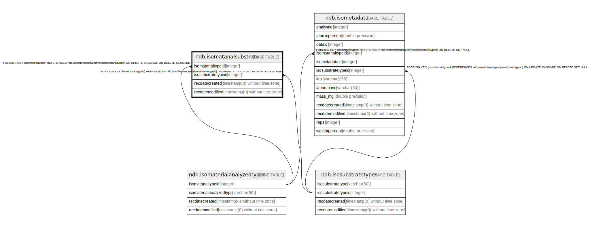

# ndb.isomatanalsubstrate

## Description

## Columns

| # | Name               | Type                           | Default                      | Nullable | Children | Parents                                                         | Comment |
| - | ------------------ | ------------------------------ | ---------------------------- | -------- | -------- | --------------------------------------------------------------- | ------- |
| 1 | isomatanaltypeid   | integer                        |                              | false    |          | [ndb.isomaterialanalyzedtypes](ndb.isomaterialanalyzedtypes.md) |         |
| 2 | isosubstratetypeid | integer                        |                              | false    |          | [ndb.isosubstratetypes](ndb.isosubstratetypes.md)               |         |
| 3 | recdatecreated     | timestamp(0) without time zone | timezone('UTC'::text, now()) | false    |          |                                                                 |         |
| 4 | recdatemodified    | timestamp(0) without time zone |                              | false    |          |                                                                 |         |

## Constraints

| # | Name                                            | Type        | Definition                                                                                                                   |
| - | ----------------------------------------------- | ----------- | ---------------------------------------------------------------------------------------------------------------------------- |
| 1 | fk_isomatanalsubstrate_isomaterialanalyzedtypes | FOREIGN KEY | FOREIGN KEY (isomatanaltypeid) REFERENCES ndb.isomaterialanalyzedtypes(isomatanaltypeid) ON UPDATE CASCADE ON DELETE CASCADE |
| 2 | fk_isomatanalsubstrate_isosubstratetypes        | FOREIGN KEY | FOREIGN KEY (isosubstratetypeid) REFERENCES ndb.isosubstratetypes(isosubstratetypeid) ON UPDATE CASCADE ON DELETE CASCADE    |
| 3 | isomatanalsubstrate_pkey                        | PRIMARY KEY | PRIMARY KEY (isomatanaltypeid, isosubstratetypeid)                                                                           |

## Indexes

| # | Name                     | Definition                                                                                                                 |
| - | ------------------------ | -------------------------------------------------------------------------------------------------------------------------- |
| 1 | isomatanalsubstrate_pkey | CREATE UNIQUE INDEX isomatanalsubstrate_pkey ON ndb.isomatanalsubstrate USING btree (isomatanaltypeid, isosubstratetypeid) |

## Triggers

| # | Name                | Definition                                                                                                                                       |
| - | ------------------- | ------------------------------------------------------------------------------------------------------------------------------------------------ |
| 1 | tr_sites_modifydate | CREATE TRIGGER tr_sites_modifydate BEFORE INSERT OR UPDATE ON ndb.isomatanalsubstrate FOR EACH ROW EXECUTE FUNCTION ndb.update_recdatemodified() |

## Relations

---

> Generated by [tbls](https://github.com/k1LoW/tbls)