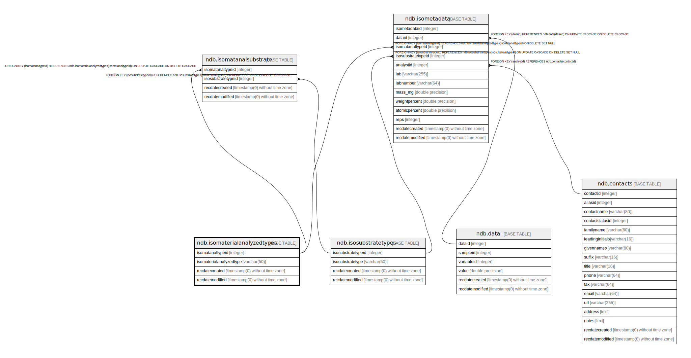

# ndb.isomaterialanalyzedtypes

## Description

## Columns

| # | Name                    | Type                           | Default                                                                | Nullable | Children                                                                                    | Parents | Comment |
| - | ----------------------- | ------------------------------ | ---------------------------------------------------------------------- | -------- | ------------------------------------------------------------------------------------------- | ------- | ------- |
| 1 | isomatanaltypeid        | integer                        | nextval('ndb.seq_isomaterialanalyzedtypes_isomatanaltypeid'::regclass) | false    | [ndb.isomatanalsubstrate](ndb.isomatanalsubstrate.md) [ndb.isometadata](ndb.isometadata.md) |         |         |
| 2 | isomaterialanalyzedtype | varchar(50)                    |                                                                        | false    |                                                                                             |         |         |
| 3 | recdatecreated          | timestamp(0) without time zone | timezone('UTC'::text, now())                                           | false    |                                                                                             |         |         |
| 4 | recdatemodified         | timestamp(0) without time zone |                                                                        | false    |                                                                                             |         |         |

## Viewpoints

| Name                                      | Definition                           |
| ----------------------------------------- | ------------------------------------ |
| [Controlled Vocabularies](viewpoint-0.md) | Tables with controlled vocabularies. |

## Constraints

| # | Name                          | Type        | Definition                     |
| - | ----------------------------- | ----------- | ------------------------------ |
| 1 | isomaterialanalyzedtypes_pkey | PRIMARY KEY | PRIMARY KEY (isomatanaltypeid) |

## Indexes

| # | Name                          | Definition                                                                                                       |
| - | ----------------------------- | ---------------------------------------------------------------------------------------------------------------- |
| 1 | isomaterialanalyzedtypes_pkey | CREATE UNIQUE INDEX isomaterialanalyzedtypes_pkey ON ndb.isomaterialanalyzedtypes USING btree (isomatanaltypeid) |

## Triggers

| # | Name                | Definition                                                                                                                                            |
| - | ------------------- | ----------------------------------------------------------------------------------------------------------------------------------------------------- |
| 1 | tr_sites_modifydate | CREATE TRIGGER tr_sites_modifydate BEFORE INSERT OR UPDATE ON ndb.isomaterialanalyzedtypes FOR EACH ROW EXECUTE FUNCTION ndb.update_recdatemodified() |

## Relations

---

> Generated by [tbls](https://github.com/k1LoW/tbls)