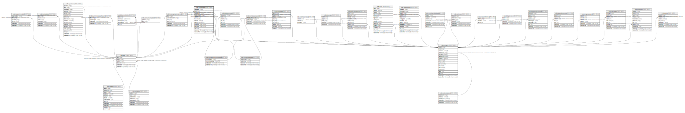

# ndb.isometadata

## Description

## Columns

| #  | Name               | Type                           | Default                                                | Nullable | Children | Parents                                                         | Comment |
| -- | ------------------ | ------------------------------ | ------------------------------------------------------ | -------- | -------- | --------------------------------------------------------------- | ------- |
| 1  | isometadataid      | integer                        | nextval('ndb.seq_isometadata_isometadataid'::regclass) | false    |          |                                                                 |         |
| 2  | dataid             | integer                        |                                                        | false    |          | [ndb.data](ndb.data.md)                                         |         |
| 3  | isomatanaltypeid   | integer                        |                                                        | true     |          | [ndb.isomaterialanalyzedtypes](ndb.isomaterialanalyzedtypes.md) |         |
| 4  | isosubstratetypeid | integer                        |                                                        | true     |          | [ndb.isosubstratetypes](ndb.isosubstratetypes.md)               |         |
| 5  | analystid          | integer                        |                                                        | true     |          | [ndb.contacts](ndb.contacts.md)                                 |         |
| 6  | lab                | varchar(255)                   |                                                        | true     |          |                                                                 |         |
| 7  | labnumber          | varchar(64)                    |                                                        | true     |          |                                                                 |         |
| 8  | mass_mg            | double precision               |                                                        | true     |          |                                                                 |         |
| 9  | weightpercent      | double precision               |                                                        | true     |          |                                                                 |         |
| 10 | atomicpercent      | double precision               |                                                        | true     |          |                                                                 |         |
| 11 | reps               | integer                        |                                                        | true     |          |                                                                 |         |
| 12 | recdatecreated     | timestamp(0) without time zone | timezone('UTC'::text, now())                           | false    |          |                                                                 |         |
| 13 | recdatemodified    | timestamp(0) without time zone |                                                        | false    |          |                                                                 |         |

## Constraints

| # | Name                                    | Type        | Definition                                                                                                                 |
| - | --------------------------------------- | ----------- | -------------------------------------------------------------------------------------------------------------------------- |
| 1 | fk_isometadata_contacts                 | FOREIGN KEY | FOREIGN KEY (analystid) REFERENCES ndb.contacts(contactid)                                                                 |
| 2 | fk_isometadata_data                     | FOREIGN KEY | FOREIGN KEY (dataid) REFERENCES ndb.data(dataid) ON UPDATE CASCADE ON DELETE CASCADE                                       |
| 3 | fk_isometadata_isomaterialanalyzedtypes | FOREIGN KEY | FOREIGN KEY (isomatanaltypeid) REFERENCES ndb.isomaterialanalyzedtypes(isomatanaltypeid) ON DELETE SET NULL                |
| 4 | isometadata_pkey                        | PRIMARY KEY | PRIMARY KEY (isometadataid)                                                                                                |
| 5 | fk_isometadata_isosubstratetypes        | FOREIGN KEY | FOREIGN KEY (isosubstratetypeid) REFERENCES ndb.isosubstratetypes(isosubstratetypeid) ON UPDATE CASCADE ON DELETE SET NULL |

## Indexes

| # | Name             | Definition                                                                          |
| - | ---------------- | ----------------------------------------------------------------------------------- |
| 1 | isometadata_pkey | CREATE UNIQUE INDEX isometadata_pkey ON ndb.isometadata USING btree (isometadataid) |

## Triggers

| # | Name                | Definition                                                                                                                               |
| - | ------------------- | ---------------------------------------------------------------------------------------------------------------------------------------- |
| 1 | tr_sites_modifydate | CREATE TRIGGER tr_sites_modifydate BEFORE INSERT OR UPDATE ON ndb.isometadata FOR EACH ROW EXECUTE FUNCTION ndb.update_recdatemodified() |

## Relations

---

> Generated by [tbls](https://github.com/k1LoW/tbls)