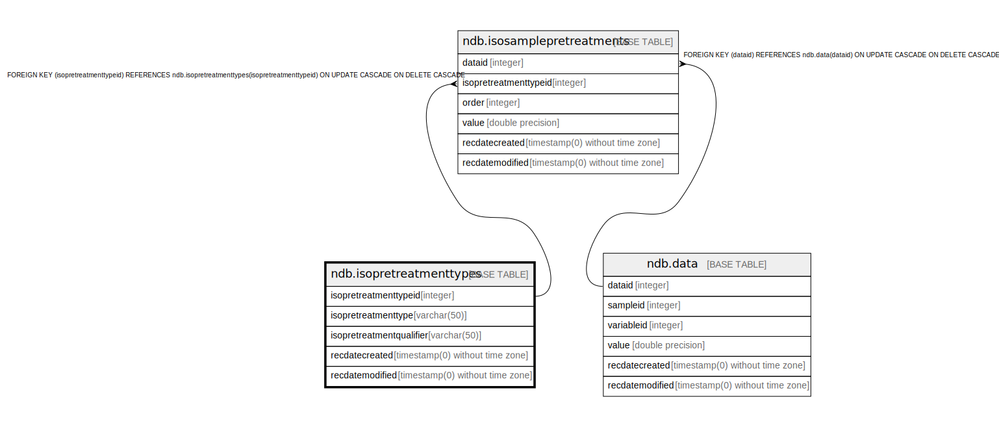

# ndb.isopretreatmenttypes

## Description

## Columns

| # | Name                     | Type                           | Default                                                                 | Nullable | Children                                                    | Parents | Comment |
| - | ------------------------ | ------------------------------ | ----------------------------------------------------------------------- | -------- | ----------------------------------------------------------- | ------- | ------- |
| 1 | isopretreatmentqualifier | varchar(50)                    |                                                                         | true     |                                                             |         |         |
| 2 | isopretreatmenttype      | varchar(50)                    |                                                                         | false    |                                                             |         |         |
| 3 | isopretreatmenttypeid    | integer                        | nextval('ndb.seq_isopretreatmenttypes_isopretreatmenttypeid'::regclass) | false    | [ndb.isosamplepretreatments](ndb.isosamplepretreatments.md) |         |         |
| 4 | recdatecreated           | timestamp(0) without time zone | timezone('UTC'::text, now())                                            | false    |                                                             |         |         |
| 5 | recdatemodified          | timestamp(0) without time zone |                                                                         | false    |                                                             |         |         |

## Viewpoints

| Name                                      | Definition                           |
| ----------------------------------------- | ------------------------------------ |
| [Controlled Vocabularies](viewpoint-0.md) | Tables with controlled vocabularies. |

## Constraints

| # | Name                      | Type        | Definition                          |
| - | ------------------------- | ----------- | ----------------------------------- |
| 1 | isopretreatmenttypes_pkey | PRIMARY KEY | PRIMARY KEY (isopretreatmenttypeid) |

## Indexes

| # | Name                      | Definition                                                                                                    |
| - | ------------------------- | ------------------------------------------------------------------------------------------------------------- |
| 1 | isopretreatmenttypes_pkey | CREATE UNIQUE INDEX isopretreatmenttypes_pkey ON ndb.isopretreatmenttypes USING btree (isopretreatmenttypeid) |

## Triggers

| # | Name                | Definition                                                                                                                                        |
| - | ------------------- | ------------------------------------------------------------------------------------------------------------------------------------------------- |
| 1 | tr_sites_modifydate | CREATE TRIGGER tr_sites_modifydate BEFORE INSERT OR UPDATE ON ndb.isopretreatmenttypes FOR EACH ROW EXECUTE FUNCTION ndb.update_recdatemodified() |

## Relations

---

> Generated by [tbls](https://github.com/k1LoW/tbls)