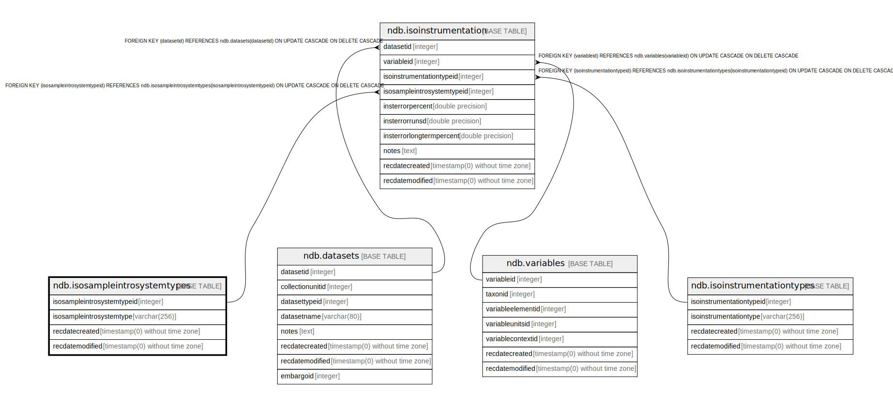

# ndb.isosampleintrosystemtypes

## Description

## Columns

| # | Name                       | Type                           | Default                                                                           | Nullable | Children                                            | Parents | Comment |
| - | -------------------------- | ------------------------------ | --------------------------------------------------------------------------------- | -------- | --------------------------------------------------- | ------- | ------- |
| 1 | isosampleintrosystemtype   | varchar(256)                   |                                                                                   | false    |                                                     |         |         |
| 2 | isosampleintrosystemtypeid | integer                        | nextval('ndb.seq_isosampleintrosystemtypes_isosampleintrosystemtypeid'::regclass) | false    | [ndb.isoinstrumentation](ndb.isoinstrumentation.md) |         |         |
| 3 | recdatecreated             | timestamp(0) without time zone | timezone('UTC'::text, now())                                                      | false    |                                                     |         |         |
| 4 | recdatemodified            | timestamp(0) without time zone |                                                                                   | false    |                                                     |         |         |

## Constraints

| # | Name                           | Type        | Definition                               |
| - | ------------------------------ | ----------- | ---------------------------------------- |
| 1 | isosampleintrosystemtypes_pkey | PRIMARY KEY | PRIMARY KEY (isosampleintrosystemtypeid) |

## Indexes

| # | Name                           | Definition                                                                                                                   |
| - | ------------------------------ | ---------------------------------------------------------------------------------------------------------------------------- |
| 1 | isosampleintrosystemtypes_pkey | CREATE UNIQUE INDEX isosampleintrosystemtypes_pkey ON ndb.isosampleintrosystemtypes USING btree (isosampleintrosystemtypeid) |

## Triggers

| # | Name                | Definition                                                                                                                                             |
| - | ------------------- | ------------------------------------------------------------------------------------------------------------------------------------------------------ |
| 1 | tr_sites_modifydate | CREATE TRIGGER tr_sites_modifydate BEFORE INSERT OR UPDATE ON ndb.isosampleintrosystemtypes FOR EACH ROW EXECUTE FUNCTION ndb.update_recdatemodified() |

## Relations

---

> Generated by [tbls](https://github.com/k1LoW/tbls)