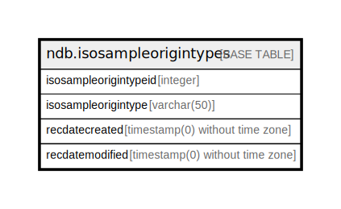

# ndb.isosampleorigintypes

## Description

## Columns

| # | Name                  | Type                           | Default                                                                 | Nullable | Children | Parents | Comment |
| - | --------------------- | ------------------------------ | ----------------------------------------------------------------------- | -------- | -------- | ------- | ------- |
| 1 | isosampleorigintype   | varchar(50)                    |                                                                         | false    |          |         |         |
| 2 | isosampleorigintypeid | integer                        | nextval('ndb.seq_isosampleorigintypes_isosampleorigintypeid'::regclass) | false    |          |         |         |
| 3 | recdatecreated        | timestamp(0) without time zone | timezone('UTC'::text, now())                                            | false    |          |         |         |
| 4 | recdatemodified       | timestamp(0) without time zone |                                                                         | false    |          |         |         |

## Constraints

| # | Name                      | Type        | Definition                          |
| - | ------------------------- | ----------- | ----------------------------------- |
| 1 | isosampleorigintypes_pkey | PRIMARY KEY | PRIMARY KEY (isosampleorigintypeid) |

## Indexes

| # | Name                      | Definition                                                                                                    |
| - | ------------------------- | ------------------------------------------------------------------------------------------------------------- |
| 1 | isosampleorigintypes_pkey | CREATE UNIQUE INDEX isosampleorigintypes_pkey ON ndb.isosampleorigintypes USING btree (isosampleorigintypeid) |

## Triggers

| # | Name                | Definition                                                                                                                                        |
| - | ------------------- | ------------------------------------------------------------------------------------------------------------------------------------------------- |
| 1 | tr_sites_modifydate | CREATE TRIGGER tr_sites_modifydate BEFORE INSERT OR UPDATE ON ndb.isosampleorigintypes FOR EACH ROW EXECUTE FUNCTION ndb.update_recdatemodified() |

## Relations

---

> Generated by [tbls](https://github.com/k1LoW/tbls)