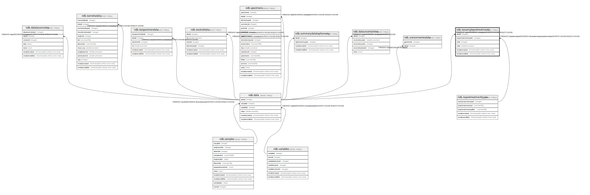

# ndb.isosamplepretreatments

## Description

## Columns

| # | Name                  | Type                           | Default                      | Nullable | Children | Parents                                                 | Comment |
| - | --------------------- | ------------------------------ | ---------------------------- | -------- | -------- | ------------------------------------------------------- | ------- |
| 1 | dataid                | integer                        |                              | false    |          | [ndb.data](ndb.data.md)                                 |         |
| 2 | isopretreatmenttypeid | integer                        |                              | false    |          | [ndb.isopretreatmenttypes](ndb.isopretreatmenttypes.md) |         |
| 3 | order                 | integer                        |                              | false    |          |                                                         |         |
| 4 | recdatecreated        | timestamp(0) without time zone | timezone('UTC'::text, now()) | false    |          |                                                         |         |
| 5 | recdatemodified       | timestamp(0) without time zone |                              | false    |          |                                                         |         |
| 6 | value                 | double precision               |                              | true     |          |                                                         |         |

## Constraints

| # | Name                                          | Type        | Definition                                                                                                                         |
| - | --------------------------------------------- | ----------- | ---------------------------------------------------------------------------------------------------------------------------------- |
| 1 | fk_isosamplepretreatments_data                | FOREIGN KEY | FOREIGN KEY (dataid) REFERENCES ndb.data(dataid) ON UPDATE CASCADE ON DELETE CASCADE                                               |
| 2 | fk_isosamplepretreatments_isopretratmenttypes | FOREIGN KEY | FOREIGN KEY (isopretreatmenttypeid) REFERENCES ndb.isopretreatmenttypes(isopretreatmenttypeid) ON UPDATE CASCADE ON DELETE CASCADE |
| 3 | isosamplepretreatments_pkey                   | PRIMARY KEY | PRIMARY KEY (dataid, isopretreatmenttypeid, "order")                                                                               |

## Indexes

| # | Name                        | Definition                                                                                                                         |
| - | --------------------------- | ---------------------------------------------------------------------------------------------------------------------------------- |
| 1 | isosamplepretreatments_pkey | CREATE UNIQUE INDEX isosamplepretreatments_pkey ON ndb.isosamplepretreatments USING btree (dataid, isopretreatmenttypeid, "order") |

## Triggers

| # | Name                | Definition                                                                                                                                          |
| - | ------------------- | --------------------------------------------------------------------------------------------------------------------------------------------------- |
| 1 | tr_sites_modifydate | CREATE TRIGGER tr_sites_modifydate BEFORE INSERT OR UPDATE ON ndb.isosamplepretreatments FOR EACH ROW EXECUTE FUNCTION ndb.update_recdatemodified() |

## Relations

---

> Generated by [tbls](https://github.com/k1LoW/tbls)