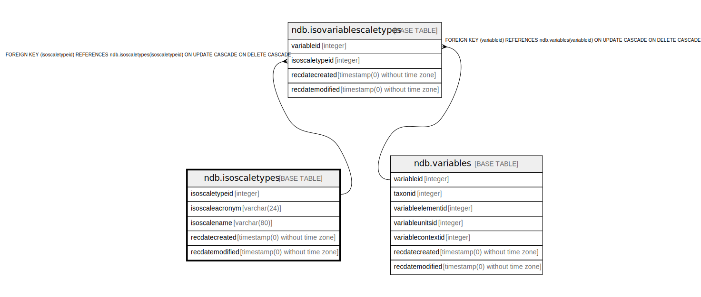

# ndb.isoscaletypes

## Description

## Columns

| # | Name            | Type                           | Default                                                   | Nullable | Children                                                  | Parents | Comment |
| - | --------------- | ------------------------------ | --------------------------------------------------------- | -------- | --------------------------------------------------------- | ------- | ------- |
| 1 | isoscaletypeid  | integer                        | nextval('ndb.seq_isoscaletypes_isoscaletypeid'::regclass) | false    | [ndb.isovariablescaletypes](ndb.isovariablescaletypes.md) |         |         |
| 2 | isoscaleacronym | varchar(24)                    |                                                           | false    |                                                           |         |         |
| 3 | isoscalename    | varchar(80)                    |                                                           | false    |                                                           |         |         |
| 4 | recdatecreated  | timestamp(0) without time zone | timezone('UTC'::text, now())                              | false    |                                                           |         |         |
| 5 | recdatemodified | timestamp(0) without time zone |                                                           | false    |                                                           |         |         |

## Constraints

| # | Name               | Type        | Definition                   |
| - | ------------------ | ----------- | ---------------------------- |
| 1 | isoscaletypes_pkey | PRIMARY KEY | PRIMARY KEY (isoscaletypeid) |

## Indexes

| # | Name               | Definition                                                                               |
| - | ------------------ | ---------------------------------------------------------------------------------------- |
| 1 | isoscaletypes_pkey | CREATE UNIQUE INDEX isoscaletypes_pkey ON ndb.isoscaletypes USING btree (isoscaletypeid) |

## Triggers

| # | Name                | Definition                                                                                                                                 |
| - | ------------------- | ------------------------------------------------------------------------------------------------------------------------------------------ |
| 1 | tr_sites_modifydate | CREATE TRIGGER tr_sites_modifydate BEFORE INSERT OR UPDATE ON ndb.isoscaletypes FOR EACH ROW EXECUTE FUNCTION ndb.update_recdatemodified() |

## Relations

---

> Generated by [tbls](https://github.com/k1LoW/tbls)