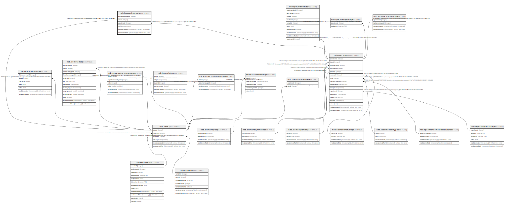

# ndb.isospecimendata

## Description

## Columns

| # | Name              | Type                           | Default                                                        | Nullable | Children | Parents                           | Comment |
| - | ----------------- | ------------------------------ | -------------------------------------------------------------- | -------- | -------- | --------------------------------- | ------- |
| 1 | dataid            | integer                        |                                                                | false    |          | [ndb.data](ndb.data.md)           |         |
| 2 | isospecimendataid | integer                        | nextval('ndb.seq_isospecimendata_isospecimendataid'::regclass) | false    |          |                                   |         |
| 3 | recdatecreated    | timestamp(0) without time zone | timezone('UTC'::text, now())                                   | false    |          |                                   |         |
| 4 | recdatemodified   | timestamp(0) without time zone |                                                                | false    |          |                                   |         |
| 5 | sd                | double precision               |                                                                | true     |          |                                   |         |
| 6 | specimenid        | integer                        |                                                                | false    |          | [ndb.specimens](ndb.specimens.md) |         |

## Constraints

| # | Name                         | Type        | Definition                                                                           |
| - | ---------------------------- | ----------- | ------------------------------------------------------------------------------------ |
| 1 | fk_isospecimendata_data      | FOREIGN KEY | FOREIGN KEY (dataid) REFERENCES ndb.data(dataid) ON UPDATE CASCADE ON DELETE CASCADE |
| 2 | fk_isospecimendata_specimens | FOREIGN KEY | FOREIGN KEY (specimenid) REFERENCES ndb.specimens(specimenid) ON DELETE CASCADE      |
| 3 | isospecimendata_pkey         | PRIMARY KEY | PRIMARY KEY (isospecimendataid)                                                      |

## Indexes

| # | Name                 | Definition                                                                                      |
| - | -------------------- | ----------------------------------------------------------------------------------------------- |
| 1 | isospecimendata_pkey | CREATE UNIQUE INDEX isospecimendata_pkey ON ndb.isospecimendata USING btree (isospecimendataid) |

## Triggers

| # | Name                | Definition                                                                                                                                   |
| - | ------------------- | -------------------------------------------------------------------------------------------------------------------------------------------- |
| 1 | tr_sites_modifydate | CREATE TRIGGER tr_sites_modifydate BEFORE INSERT OR UPDATE ON ndb.isospecimendata FOR EACH ROW EXECUTE FUNCTION ndb.update_recdatemodified() |

## Relations

---

> Generated by [tbls](https://github.com/k1LoW/tbls)