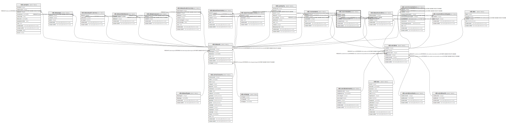

# ndb.isosrmetadata

## Description

## Columns

| # | Name               | Type                           | Default                      | Nullable | Children | Parents                           | Comment |
| - | ------------------ | ------------------------------ | ---------------------------- | -------- | -------- | --------------------------------- | ------- |
| 1 | datasetid          | integer                        |                              | false    |          | [ndb.datasets](ndb.datasets.md)   |         |
| 2 | variableid         | integer                        |                              | false    |          | [ndb.variables](ndb.variables.md) |         |
| 3 | srlocalvalue       | double precision               |                              | true     |          |                                   |         |
| 4 | srlocalgeolcontext | text                           |                              | true     |          |                                   |         |
| 5 | recdatecreated     | timestamp(0) without time zone | timezone('UTC'::text, now()) | false    |          |                                   |         |
| 6 | recdatemodified    | timestamp(0) without time zone |                              | false    |          |                                   |         |

## Constraints

| # | Name                       | Type        | Definition                                                                                        |
| - | -------------------------- | ----------- | ------------------------------------------------------------------------------------------------- |
| 1 | fk_isosrmetadata_datasets  | FOREIGN KEY | FOREIGN KEY (datasetid) REFERENCES ndb.datasets(datasetid) ON UPDATE CASCADE ON DELETE CASCADE    |
| 2 | isosrmetadata_pkey         | PRIMARY KEY | PRIMARY KEY (datasetid, variableid)                                                               |
| 3 | fk_isosrmetadata_variables | FOREIGN KEY | FOREIGN KEY (variableid) REFERENCES ndb.variables(variableid) ON UPDATE CASCADE ON DELETE CASCADE |

## Indexes

| # | Name               | Definition                                                                                      |
| - | ------------------ | ----------------------------------------------------------------------------------------------- |
| 1 | isosrmetadata_pkey | CREATE UNIQUE INDEX isosrmetadata_pkey ON ndb.isosrmetadata USING btree (datasetid, variableid) |

## Triggers

| # | Name                | Definition                                                                                                                                 |
| - | ------------------- | ------------------------------------------------------------------------------------------------------------------------------------------ |
| 1 | tr_sites_modifydate | CREATE TRIGGER tr_sites_modifydate BEFORE INSERT OR UPDATE ON ndb.isosrmetadata FOR EACH ROW EXECUTE FUNCTION ndb.update_recdatemodified() |

## Relations

---

> Generated by [tbls](https://github.com/k1LoW/tbls)