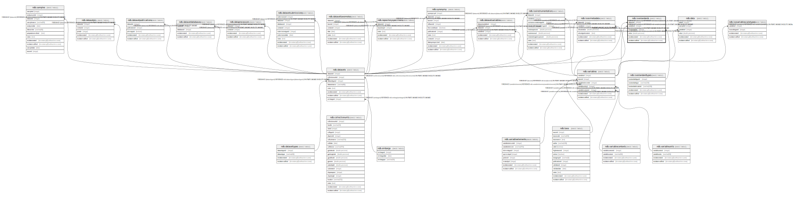

# ndb.isostandards

## Description

## Columns

| # | Name            | Type                           | Default                      | Nullable | Children | Parents                                         | Comment |
| - | --------------- | ------------------------------ | ---------------------------- | -------- | -------- | ----------------------------------------------- | ------- |
| 1 | datasetid       | integer                        |                              | false    |          | [ndb.datasets](ndb.datasets.md)                 |         |
| 2 | variableid      | integer                        |                              | false    |          | [ndb.variables](ndb.variables.md)               |         |
| 3 | isostandardid   | integer                        |                              | false    |          | [ndb.isostandardtypes](ndb.isostandardtypes.md) |         |
| 4 | value           | double precision               |                              | false    |          |                                                 |         |
| 5 | recdatecreated  | timestamp(0) without time zone | timezone('UTC'::text, now()) | false    |          |                                                 |         |
| 6 | recdatemodified | timestamp(0) without time zone |                              | false    |          |                                                 |         |

## Constraints

| # | Name                             | Type        | Definition                                                                                                         |
| - | -------------------------------- | ----------- | ------------------------------------------------------------------------------------------------------------------ |
| 1 | fk_isostandards_datasets         | FOREIGN KEY | FOREIGN KEY (datasetid) REFERENCES ndb.datasets(datasetid) ON UPDATE CASCADE ON DELETE CASCADE                     |
| 2 | isostandards_pkey                | PRIMARY KEY | PRIMARY KEY (datasetid, variableid, isostandardid)                                                                 |
| 3 | fk_isostandards_isostandardtypes | FOREIGN KEY | FOREIGN KEY (isostandardid) REFERENCES ndb.isostandardtypes(isostandardtypeid) ON UPDATE CASCADE ON DELETE CASCADE |
| 4 | fk_isostandards_variables        | FOREIGN KEY | FOREIGN KEY (variableid) REFERENCES ndb.variables(variableid) ON UPDATE CASCADE ON DELETE CASCADE                  |

## Indexes

| # | Name              | Definition                                                                                                   |
| - | ----------------- | ------------------------------------------------------------------------------------------------------------ |
| 1 | isostandards_pkey | CREATE UNIQUE INDEX isostandards_pkey ON ndb.isostandards USING btree (datasetid, variableid, isostandardid) |

## Triggers

| # | Name                | Definition                                                                                                                                |
| - | ------------------- | ----------------------------------------------------------------------------------------------------------------------------------------- |
| 1 | tr_sites_modifydate | CREATE TRIGGER tr_sites_modifydate BEFORE INSERT OR UPDATE ON ndb.isostandards FOR EACH ROW EXECUTE FUNCTION ndb.update_recdatemodified() |

## Relations

---

> Generated by [tbls](https://github.com/k1LoW/tbls)