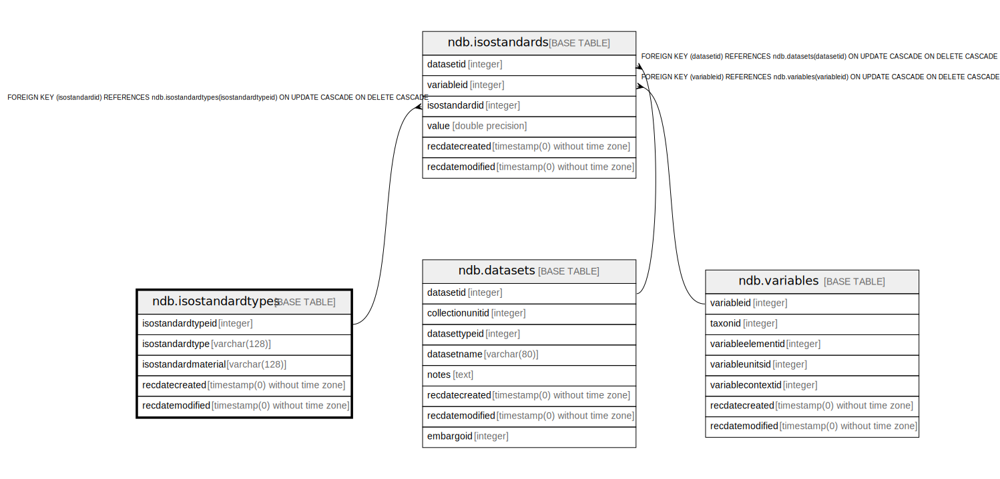

# ndb.isostandardtypes

## Description

## Columns

| # | Name                | Type                           | Default                                                         | Nullable | Children                                | Parents | Comment |
| - | ------------------- | ------------------------------ | --------------------------------------------------------------- | -------- | --------------------------------------- | ------- | ------- |
| 1 | isostandardtypeid   | integer                        | nextval('ndb.seq_isostandardtypes_isostandardtypeid'::regclass) | false    | [ndb.isostandards](ndb.isostandards.md) |         |         |
| 2 | isostandardtype     | varchar(128)                   |                                                                 | false    |                                         |         |         |
| 3 | isostandardmaterial | varchar(128)                   |                                                                 | false    |                                         |         |         |
| 4 | recdatecreated      | timestamp(0) without time zone | timezone('UTC'::text, now())                                    | false    |                                         |         |         |
| 5 | recdatemodified     | timestamp(0) without time zone |                                                                 | false    |                                         |         |         |

## Constraints

| # | Name                  | Type        | Definition                      |
| - | --------------------- | ----------- | ------------------------------- |
| 1 | isostandardtypes_pkey | PRIMARY KEY | PRIMARY KEY (isostandardtypeid) |

## Indexes

| # | Name                  | Definition                                                                                        |
| - | --------------------- | ------------------------------------------------------------------------------------------------- |
| 1 | isostandardtypes_pkey | CREATE UNIQUE INDEX isostandardtypes_pkey ON ndb.isostandardtypes USING btree (isostandardtypeid) |

## Triggers

| # | Name                | Definition                                                                                                                                    |
| - | ------------------- | --------------------------------------------------------------------------------------------------------------------------------------------- |
| 1 | tr_sites_modifydate | CREATE TRIGGER tr_sites_modifydate BEFORE INSERT OR UPDATE ON ndb.isostandardtypes FOR EACH ROW EXECUTE FUNCTION ndb.update_recdatemodified() |

## Relations

---

> Generated by [tbls](https://github.com/k1LoW/tbls)