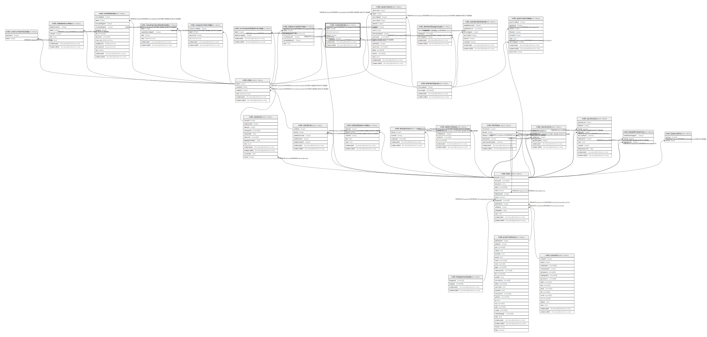

# ndb.isostratdata

## Description

## Columns

| # | Name            | Type                           | Default                      | Nullable | Children | Parents                                 | Comment |
| - | --------------- | ------------------------------ | ---------------------------- | -------- | -------- | --------------------------------------- | ------- |
| 1 | dataid          | integer                        |                              | false    |          | [ndb.data](ndb.data.md)                 |         |
| 2 | elementtypeid   | integer                        |                              | true     |          | [ndb.elementtypes](ndb.elementtypes.md) |         |
| 3 | recdatecreated  | timestamp(0) without time zone | timezone('UTC'::text, now()) | false    |          |                                         |         |
| 4 | recdatemodified | timestamp(0) without time zone |                              | false    |          |                                         |         |
| 5 | sd              | double precision               |                              | true     |          |                                         |         |
| 6 | taxonid         | integer                        |                              | true     |          | [ndb.taxa](ndb.taxa.md)                 |         |

## Constraints

| # | Name                         | Type        | Definition                                                                                                 |
| - | ---------------------------- | ----------- | ---------------------------------------------------------------------------------------------------------- |
| 1 | fk_isostratdata_data         | FOREIGN KEY | FOREIGN KEY (dataid) REFERENCES ndb.data(dataid) ON UPDATE CASCADE ON DELETE CASCADE                       |
| 2 | fk_isostratdata_elementtypes | FOREIGN KEY | FOREIGN KEY (elementtypeid) REFERENCES ndb.elementtypes(elementtypeid) ON UPDATE CASCADE ON DELETE CASCADE |
| 3 | fk_isostratdata_taxa         | FOREIGN KEY | FOREIGN KEY (taxonid) REFERENCES ndb.taxa(taxonid)                                                         |
| 4 | isostratdata_pkey            | PRIMARY KEY | PRIMARY KEY (dataid)                                                                                       |

## Indexes

| # | Name              | Definition                                                                     |
| - | ----------------- | ------------------------------------------------------------------------------ |
| 1 | isostratdata_pkey | CREATE UNIQUE INDEX isostratdata_pkey ON ndb.isostratdata USING btree (dataid) |

## Triggers

| # | Name                | Definition                                                                                                                                |
| - | ------------------- | ----------------------------------------------------------------------------------------------------------------------------------------- |
| 1 | tr_sites_modifydate | CREATE TRIGGER tr_sites_modifydate BEFORE INSERT OR UPDATE ON ndb.isostratdata FOR EACH ROW EXECUTE FUNCTION ndb.update_recdatemodified() |

## Relations

---

> Generated by [tbls](https://github.com/k1LoW/tbls)