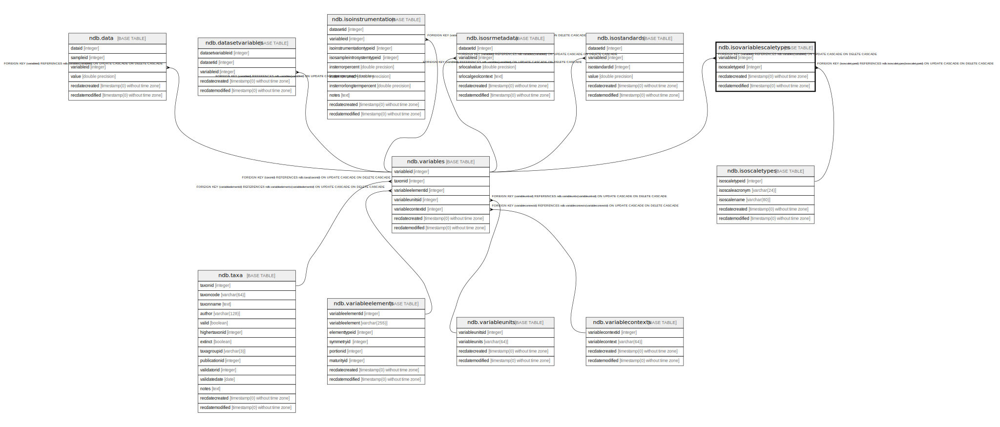

# ndb.isovariablescaletypes

## Description

## Columns

| # | Name            | Type                           | Default                      | Nullable | Children | Parents                                   | Comment |
| - | --------------- | ------------------------------ | ---------------------------- | -------- | -------- | ----------------------------------------- | ------- |
| 1 | isoscaletypeid  | integer                        |                              | false    |          | [ndb.isoscaletypes](ndb.isoscaletypes.md) |         |
| 2 | recdatecreated  | timestamp(0) without time zone | timezone('UTC'::text, now()) | false    |          |                                           |         |
| 3 | recdatemodified | timestamp(0) without time zone |                              | false    |          |                                           |         |
| 4 | variableid      | integer                        |                              | false    |          | [ndb.variables](ndb.variables.md)         |         |

## Constraints

| # | Name                                   | Type        | Definition                                                                                                    |
| - | -------------------------------------- | ----------- | ------------------------------------------------------------------------------------------------------------- |
| 1 | fk_isovariablescaletypes_isoscaletypes | FOREIGN KEY | FOREIGN KEY (isoscaletypeid) REFERENCES ndb.isoscaletypes(isoscaletypeid) ON UPDATE CASCADE ON DELETE CASCADE |
| 2 | fk_isovariablescaletypes_variables     | FOREIGN KEY | FOREIGN KEY (variableid) REFERENCES ndb.variables(variableid) ON UPDATE CASCADE ON DELETE CASCADE             |
| 3 | isovariablescaletypes_pkey             | PRIMARY KEY | PRIMARY KEY (variableid, isoscaletypeid)                                                                      |

## Indexes

| # | Name                       | Definition                                                                                                           |
| - | -------------------------- | -------------------------------------------------------------------------------------------------------------------- |
| 1 | isovariablescaletypes_pkey | CREATE UNIQUE INDEX isovariablescaletypes_pkey ON ndb.isovariablescaletypes USING btree (variableid, isoscaletypeid) |

## Triggers

| # | Name                | Definition                                                                                                                                         |
| - | ------------------- | -------------------------------------------------------------------------------------------------------------------------------------------------- |
| 1 | tr_sites_modifydate | CREATE TRIGGER tr_sites_modifydate BEFORE INSERT OR UPDATE ON ndb.isovariablescaletypes FOR EACH ROW EXECUTE FUNCTION ndb.update_recdatemodified() |

## Relations

---

> Generated by [tbls](https://github.com/k1LoW/tbls)