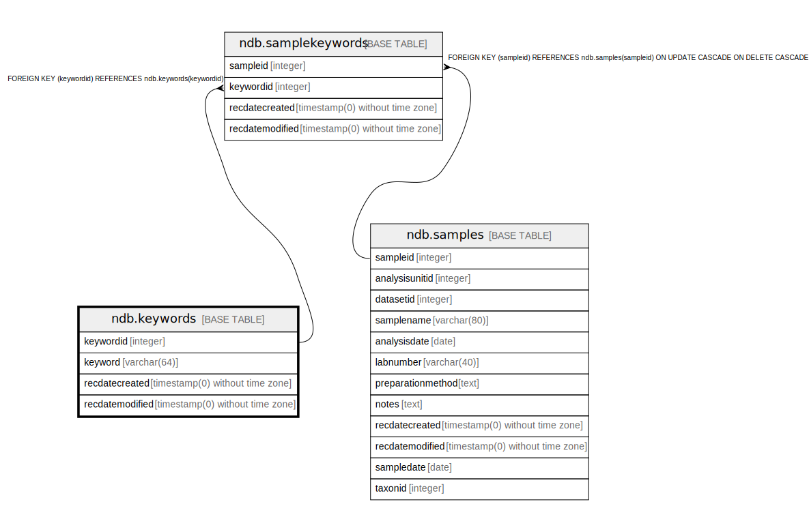

# ndb.keywords

## Description

Lookup table of Keywords referenced by the SampleKeywords table. The table provides a means to identify samples sharing a common attribute. For example, the keyword «modern sample» identifies modern surface samples in the database. These samples include individual surface samples, as well as core tops. Although not implemented, a «pre-European settlement» keyword would be a means to identify samples just predating European settlement.

## Columns

| # | Name            | Type                           | Default                                         | Nullable | Children                                    | Parents | Comment                                                       |
| - | --------------- | ------------------------------ | ----------------------------------------------- | -------- | ------------------------------------------- | ------- | ------------------------------------------------------------- |
| 1 | keyword         | varchar(64)                    |                                                 | false    |                                             |         | A keyword for identifying samples sharing a common attribute. |
| 2 | keywordid       | integer                        | nextval('ndb.seq_keywords_keywordid'::regclass) | false    | [ndb.samplekeywords](ndb.samplekeywords.md) |         | An arbitrary Keyword identification number.                   |
| 3 | recdatecreated  | timestamp(0) without time zone | timezone('UTC'::text, now())                    | false    |                                             |         |                                                               |
| 4 | recdatemodified | timestamp(0) without time zone |                                                 | false    |                                             |         |                                                               |

## Constraints

| # | Name          | Type        | Definition              |
| - | ------------- | ----------- | ----------------------- |
| 1 | keywords_pkey | PRIMARY KEY | PRIMARY KEY (keywordid) |

## Indexes

| # | Name          | Definition                                                                |
| - | ------------- | ------------------------------------------------------------------------- |
| 1 | keywords_pkey | CREATE UNIQUE INDEX keywords_pkey ON ndb.keywords USING btree (keywordid) |

## Triggers

| # | Name                | Definition                                                                                                                            |
| - | ------------------- | ------------------------------------------------------------------------------------------------------------------------------------- |
| 1 | tr_sites_modifydate | CREATE TRIGGER tr_sites_modifydate BEFORE INSERT OR UPDATE ON ndb.keywords FOR EACH ROW EXECUTE FUNCTION ndb.update_recdatemodified() |

## Relations

---

> Generated by [tbls](https://github.com/k1LoW/tbls)