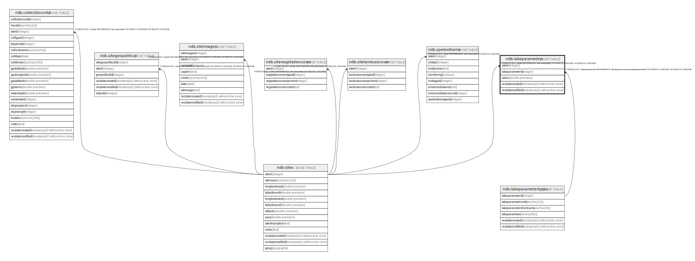

# ndb.lakeparameters

## Description

## Columns

| # | Name            | Type                           | Default                      | Nullable | Children | Parents                                             | Comment                                                |
| - | --------------- | ------------------------------ | ---------------------------- | -------- | -------- | --------------------------------------------------- | ------------------------------------------------------ |
| 1 | lakeparameterid | integer                        |                              | false    |          | [ndb.lakeparametertypes](ndb.lakeparametertypes.md) | FK: LakeParameter ID links to LakeParameterTypes table |
| 2 | recdatecreated  | timestamp(0) without time zone | timezone('UTC'::text, now()) | false    |          |                                                     |                                                        |
| 3 | recdatemodified | timestamp(0) without time zone |                              | false    |          |                                                     |                                                        |
| 4 | siteid          | integer                        |                              | false    |          | [ndb.sites](ndb.sites.md)                           | FK: SiteID links to Sites table                        |
| 5 | value           | double precision               |                              | false    |          |                                                     | Numerical value of parameter                           |

## Constraints

| # | Name                                 | Type        | Definition                                                                                                           |
| - | ------------------------------------ | ----------- | -------------------------------------------------------------------------------------------------------------------- |
| 1 | fk_lakeparameters_lakeparametertypes | FOREIGN KEY | FOREIGN KEY (lakeparameterid) REFERENCES ndb.lakeparametertypes(lakeparameterid) ON UPDATE CASCADE ON DELETE CASCADE |
| 2 | fk_lakeparameters_sites              | FOREIGN KEY | FOREIGN KEY (siteid) REFERENCES ndb.sites(siteid) ON UPDATE CASCADE ON DELETE CASCADE                                |
| 3 | lakeparameters_pkey                  | PRIMARY KEY | PRIMARY KEY (siteid, lakeparameterid)                                                                                |

## Indexes

| # | Name                              | Definition                                                                                                                |
| - | --------------------------------- | ------------------------------------------------------------------------------------------------------------------------- |
| 1 | ix_lakeparameterid_lakeparameters | CREATE INDEX ix_lakeparameterid_lakeparameters ON ndb.lakeparameters USING btree (lakeparameterid) WITH (fillfactor='10') |
| 2 | ix_siteid_lakeparameters          | CREATE INDEX ix_siteid_lakeparameters ON ndb.lakeparameters USING btree (siteid) WITH (fillfactor='10')                   |
| 3 | lakeparameters_pkey               | CREATE UNIQUE INDEX lakeparameters_pkey ON ndb.lakeparameters USING btree (siteid, lakeparameterid)                       |

## Triggers

| # | Name                | Definition                                                                                                                                  |
| - | ------------------- | ------------------------------------------------------------------------------------------------------------------------------------------- |
| 1 | tr_sites_modifydate | CREATE TRIGGER tr_sites_modifydate BEFORE INSERT OR UPDATE ON ndb.lakeparameters FOR EACH ROW EXECUTE FUNCTION ndb.update_recdatemodified() |

## Relations

---

> Generated by [tbls](https://github.com/k1LoW/tbls)