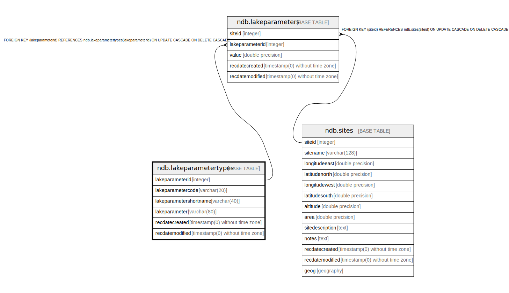

# ndb.lakeparametertypes

## Description

## Columns

| # | Name                   | Type                           | Default                                                         | Nullable | Children                                    | Parents | Comment                               |
| - | ---------------------- | ------------------------------ | --------------------------------------------------------------- | -------- | ------------------------------------------- | ------- | ------------------------------------- |
| 1 | lakeparameterid        | integer                        | nextval('ndb.seq_lakeparametertypes_lakeparameterid'::regclass) | false    | [ndb.lakeparameters](ndb.lakeparameters.md) |         | PK: LakeParameterID                   |
| 2 | lakeparametercode      | varchar(20)                    |                                                                 | false    |                                             |         | Code espcially for data entry apps    |
| 3 | lakeparametershortname | varchar(40)                    |                                                                 | false    |                                             |         | Short name useful for data entry apps |
| 4 | lakeparameter          | varchar(80)                    |                                                                 | false    |                                             |         | Full name                             |
| 5 | recdatecreated         | timestamp(0) without time zone | timezone('UTC'::text, now())                                    | false    |                                             |         |                                       |
| 6 | recdatemodified        | timestamp(0) without time zone |                                                                 | false    |                                             |         |                                       |

## Viewpoints

| Name                                      | Definition                           |
| ----------------------------------------- | ------------------------------------ |
| [Controlled Vocabularies](viewpoint-0.md) | Tables with controlled vocabularies. |

## Constraints

| # | Name                    | Type        | Definition                    |
| - | ----------------------- | ----------- | ----------------------------- |
| 1 | lakeparametertypes_pkey | PRIMARY KEY | PRIMARY KEY (lakeparameterid) |

## Indexes

| # | Name                    | Definition                                                                                          |
| - | ----------------------- | --------------------------------------------------------------------------------------------------- |
| 1 | lakeparametertypes_pkey | CREATE UNIQUE INDEX lakeparametertypes_pkey ON ndb.lakeparametertypes USING btree (lakeparameterid) |

## Triggers

| # | Name                | Definition                                                                                                                                      |
| - | ------------------- | ----------------------------------------------------------------------------------------------------------------------------------------------- |
| 1 | tr_sites_modifydate | CREATE TRIGGER tr_sites_modifydate BEFORE INSERT OR UPDATE ON ndb.lakeparametertypes FOR EACH ROW EXECUTE FUNCTION ndb.update_recdatemodified() |

## Relations

---

> Generated by [tbls](https://github.com/k1LoW/tbls)