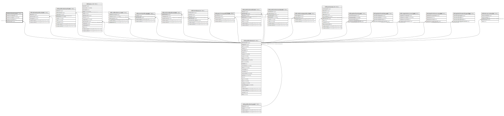

# ndb.landusetypes

## Description

## Columns

| # | Name               | Type         | Default                                                      | Nullable | Children | Parents                                 | Comment |
| - | ------------------ | ------------ | ------------------------------------------------------------ | -------- | -------- | --------------------------------------- | ------- |
| 1 | landusecovertypeid | integer      | nextval('ndb.landusetypes_landusecovertypeid_seq'::regclass) | false    |          |                                         |         |
| 2 | landusecovertype   | varchar(128) |                                                              | true     |          |                                         |         |
| 3 | landusecovernotes  | text         |                                                              | true     |          |                                         |         |
| 4 | publicationid      | integer      |                                                              | true     |          | [ndb.publications](ndb.publications.md) |         |

## Constraints

| # | Name                                        | Type        | Definition                                                             |
| - | ------------------------------------------- | ----------- | ---------------------------------------------------------------------- |
| 1 | landusetypes_landuseclasspublicationid_fkey | FOREIGN KEY | FOREIGN KEY (publicationid) REFERENCES ndb.publications(publicationid) |
| 2 | landusetypes_pkey                           | PRIMARY KEY | PRIMARY KEY (landusecovertypeid)                                       |
| 3 | landusetypes_landusecovertype_key           | UNIQUE      | UNIQUE (landusecovertype)                                              |

## Indexes

| # | Name                              | Definition                                                                                               |
| - | --------------------------------- | -------------------------------------------------------------------------------------------------------- |
| 1 | landusetypes_pkey                 | CREATE UNIQUE INDEX landusetypes_pkey ON ndb.landusetypes USING btree (landusecovertypeid)               |
| 2 | landusetypes_landusecovertype_key | CREATE UNIQUE INDEX landusetypes_landusecovertype_key ON ndb.landusetypes USING btree (landusecovertype) |

## Relations

---

> Generated by [tbls](https://github.com/k1LoW/tbls)