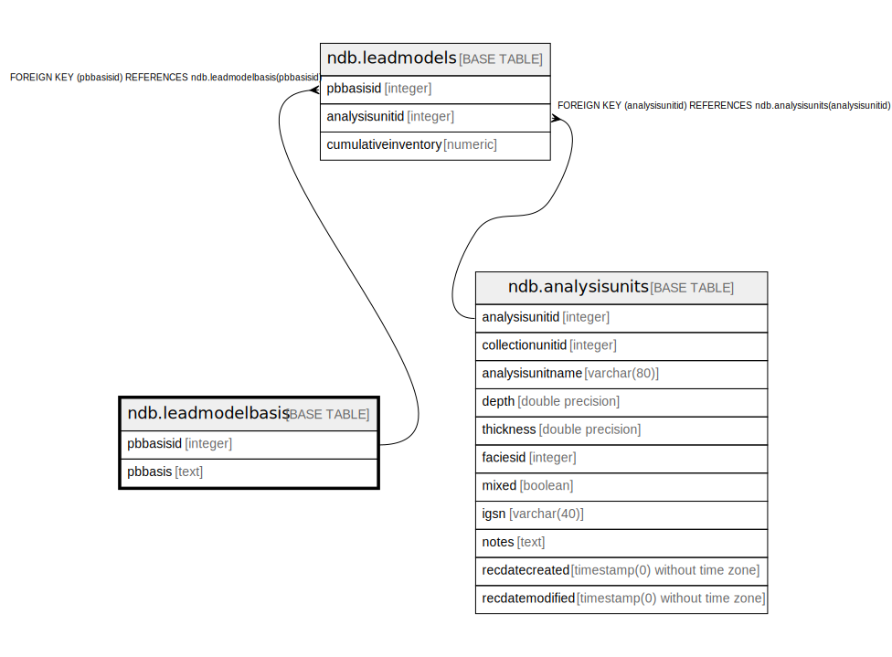

# ndb.leadmodelbasis

## Description

## Columns

| # | Name      | Type    | Default                                               | Nullable | Children                            | Parents | Comment |
| - | --------- | ------- | ----------------------------------------------------- | -------- | ----------------------------------- | ------- | ------- |
| 1 | pbbasis   | text    |                                                       | true     |                                     |         |         |
| 2 | pbbasisid | integer | nextval('ndb.leadmodelbasis_pbbasisid_seq'::regclass) | false    | [ndb.leadmodels](ndb.leadmodels.md) |         |         |

## Constraints

| # | Name                | Type        | Definition              |
| - | ------------------- | ----------- | ----------------------- |
| 1 | leadmodelbasis_pkey | PRIMARY KEY | PRIMARY KEY (pbbasisid) |

## Indexes

| # | Name                | Definition                                                                            |
| - | ------------------- | ------------------------------------------------------------------------------------- |
| 1 | leadmodelbasis_pkey | CREATE UNIQUE INDEX leadmodelbasis_pkey ON ndb.leadmodelbasis USING btree (pbbasisid) |

## Relations

---

> Generated by [tbls](https://github.com/k1LoW/tbls)