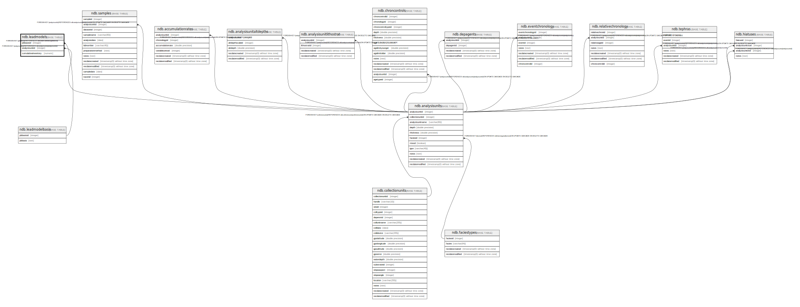

# ndb.leadmodels

## Description

## Columns

| # | Name                | Type    | Default | Nullable | Children | Parents                                     | Comment |
| - | ------------------- | ------- | ------- | -------- | -------- | ------------------------------------------- | ------- |
| 1 | analysisunitid      | integer |         | true     |          | [ndb.analysisunits](ndb.analysisunits.md)   |         |
| 2 | cumulativeinventory | numeric |         | true     |          |                                             |         |
| 3 | pbbasisid           | integer |         | true     |          | [ndb.leadmodelbasis](ndb.leadmodelbasis.md) |         |

## Constraints

| # | Name                                 | Type        | Definition                                                                |
| - | ------------------------------------ | ----------- | ------------------------------------------------------------------------- |
| 1 | leadmodels_analysisunitid_fkey       | FOREIGN KEY | FOREIGN KEY (analysisunitid) REFERENCES ndb.analysisunits(analysisunitid) |
| 2 | leadmodels_cumulativeinventory_check | CHECK       | CHECK ((cumulativeinventory > (0)::numeric))                              |
| 3 | leadmodels_pbbasisid_fkey            | FOREIGN KEY | FOREIGN KEY (pbbasisid) REFERENCES ndb.leadmodelbasis(pbbasisid)          |

## Relations

---

> Generated by [tbls](https://github.com/k1LoW/tbls)