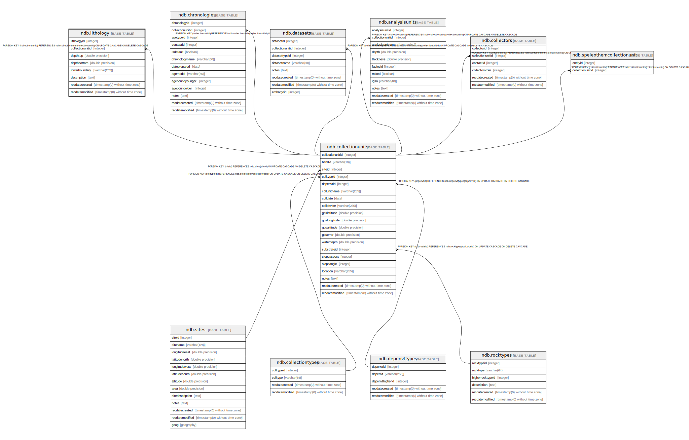

# ndb.lithology

## Description

This table stores the lithologic descriptions of Collection Units.

## Columns

| # | Name             | Type                           | Default                                            | Nullable | Children | Parents                                       | Comment                                                                                                                                                                                                                                                                                                                                                                                                                                                                      |
| - | ---------------- | ------------------------------ | -------------------------------------------------- | -------- | -------- | --------------------------------------------- | ---------------------------------------------------------------------------------------------------------------------------------------------------------------------------------------------------------------------------------------------------------------------------------------------------------------------------------------------------------------------------------------------------------------------------------------------------------------------------- |
| 1 | collectionunitid | integer                        |                                                    | false    |          | [ndb.collectionunits](ndb.collectionunits.md) | Collection Unit identification number. Field links to the CollectionUnits table.                                                                                                                                                                                                                                                                                                                                                                                             |
| 2 | depthbottom      | double precision               |                                                    | true     |          |                                               | Depth of the bottom of the lithologic unit in cm.                                                                                                                                                                                                                                                                                                                                                                                                                            |
| 3 | depthtop         | double precision               |                                                    | true     |          |                                               | Depth of the top of the lithologic unit in cm.                                                                                                                                                                                                                                                                                                                                                                                                                               |
| 4 | description      | text                           |                                                    | true     |          |                                               | Description of the lithologic unit. These can be quite detailed, with Munsell color or Troels-Smith descriptions. Some examples: interbedded gray silt and peat marly fine-detritus copropel humified sedge and Sphagnum peat sedge peat 5YR 5/4 gray sandy loam with mammoth and other animal bones grey-green gyttja, oxidizing to gray-brown Ag 3, Ga 1, medium gray, firm, elastic nig3, strf0, elas2, sicc0; Th2 T12 Tb+ Ld°4, Ga+, Dg+, Dh+ |
| 5 | lithologyid      | integer                        | nextval('ndb.seq_lithology_lithologyid'::regclass) | false    |          |                                               | An arbitrary identification number for a lithologic unit.                                                                                                                                                                                                                                                                                                                                                                                                                    |
| 6 | lowerboundary    | varchar(255)                   |                                                    | true     |          |                                               |                                                                                                                                                                                                                                                                                                                                                                                                                                                                              |
| 7 | recdatecreated   | timestamp(0) without time zone | timezone('UTC'::text, now())                       | false    |          |                                               |                                                                                                                                                                                                                                                                                                                                                                                                                                                                              |
| 8 | recdatemodified  | timestamp(0) without time zone |                                                    | false    |          |                                               |                                                                                                                                                                                                                                                                                                                                                                                                                                                                              |

## Constraints

| # | Name                         | Type        | Definition                                                                                                          |
| - | ---------------------------- | ----------- | ------------------------------------------------------------------------------------------------------------------- |
| 1 | fk_lithology_collectionunits | FOREIGN KEY | FOREIGN KEY (collectionunitid) REFERENCES ndb.collectionunits(collectionunitid) ON UPDATE CASCADE ON DELETE CASCADE |
| 2 | lithology_pkey               | PRIMARY KEY | PRIMARY KEY (lithologyid)                                                                                           |

## Indexes

| # | Name                          | Definition                                                                                                        |
| - | ----------------------------- | ----------------------------------------------------------------------------------------------------------------- |
| 1 | ix_collectionunitid_lithology | CREATE INDEX ix_collectionunitid_lithology ON ndb.lithology USING btree (collectionunitid) WITH (fillfactor='10') |
| 2 | lithology_pkey                | CREATE UNIQUE INDEX lithology_pkey ON ndb.lithology USING btree (lithologyid)                                     |

## Triggers

| # | Name                | Definition                                                                                                                             |
| - | ------------------- | -------------------------------------------------------------------------------------------------------------------------------------- |
| 1 | tr_sites_modifydate | CREATE TRIGGER tr_sites_modifydate BEFORE INSERT OR UPDATE ON ndb.lithology FOR EACH ROW EXECUTE FUNCTION ndb.update_recdatemodified() |

## Relations

---

> Generated by [tbls](https://github.com/k1LoW/tbls)