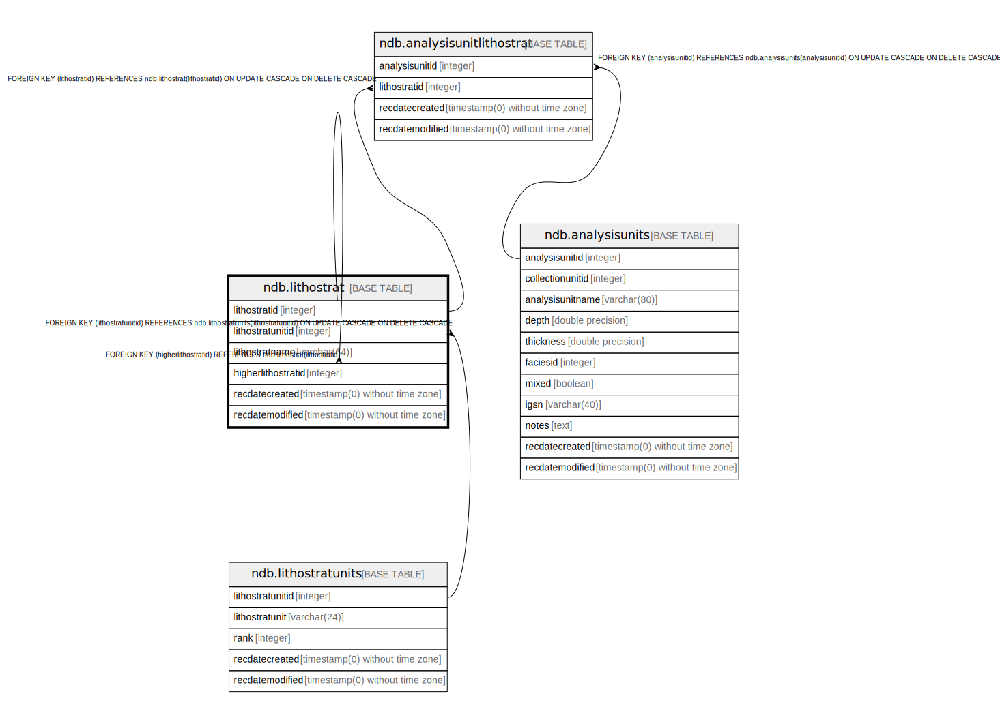

# ndb.lithostrat

## Description

## Columns

| # | Name               | Type                           | Default                                              | Nullable | Children                                                                                        | Parents                                       | Comment |
| - | ------------------ | ------------------------------ | ---------------------------------------------------- | -------- | ----------------------------------------------------------------------------------------------- | --------------------------------------------- | ------- |
| 1 | higherlithostratid | integer                        |                                                      | false    |                                                                                                 | [ndb.lithostrat](ndb.lithostrat.md)           |         |
| 2 | lithostratid       | integer                        | nextval('ndb.seq_lithostrat_lithostratid'::regclass) | false    | [ndb.analysisunitlithostrat](ndb.analysisunitlithostrat.md) [ndb.lithostrat](ndb.lithostrat.md) |                                               |         |
| 3 | lithostratname     | varchar(64)                    |                                                      | false    |                                                                                                 |                                               |         |
| 4 | lithostratunitid   | integer                        |                                                      | false    |                                                                                                 | [ndb.lithostratunits](ndb.lithostratunits.md) |         |
| 5 | recdatecreated     | timestamp(0) without time zone | timezone('UTC'::text, now())                         | false    |                                                                                                 |                                               |         |
| 6 | recdatemodified    | timestamp(0) without time zone |                                                      | false    |                                                                                                 |                                               |         |

## Viewpoints

| Name                                  | Definition                        |
| ------------------------------------- | --------------------------------- |
| [Hierarchical Tables](viewpoint-1.md) | Tables with internal hierarchies. |

## Constraints

| # | Name                               | Type        | Definition                                                                                                          |
| - | ---------------------------------- | ----------- | ------------------------------------------------------------------------------------------------------------------- |
| 1 | fk_higherlithostratid              | FOREIGN KEY | FOREIGN KEY (higherlithostratid) REFERENCES ndb.lithostrat(lithostratid)                                            |
| 2 | fk_lithostratunits_lithostrattypes | FOREIGN KEY | FOREIGN KEY (lithostratunitid) REFERENCES ndb.lithostratunits(lithostratunitid) ON UPDATE CASCADE ON DELETE CASCADE |
| 3 | lithostrat_pkey                    | PRIMARY KEY | PRIMARY KEY (lithostratid)                                                                                          |

## Indexes

| # | Name            | Definition                                                                       |
| - | --------------- | -------------------------------------------------------------------------------- |
| 1 | lithostrat_pkey | CREATE UNIQUE INDEX lithostrat_pkey ON ndb.lithostrat USING btree (lithostratid) |

## Triggers

| # | Name                | Definition                                                                                                                              |
| - | ------------------- | --------------------------------------------------------------------------------------------------------------------------------------- |
| 1 | tr_sites_modifydate | CREATE TRIGGER tr_sites_modifydate BEFORE INSERT OR UPDATE ON ndb.lithostrat FOR EACH ROW EXECUTE FUNCTION ndb.update_recdatemodified() |

## Relations

---

> Generated by [tbls](https://github.com/k1LoW/tbls)