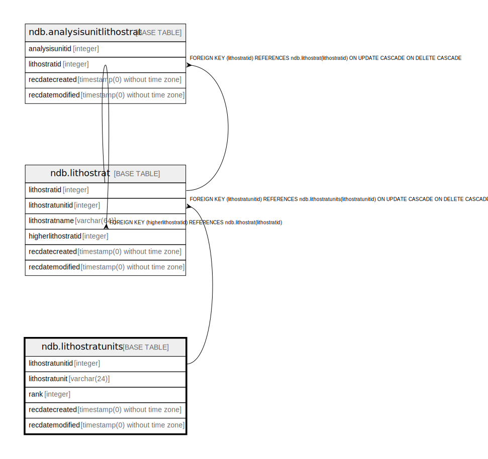

# ndb.lithostratunits

## Description

## Columns

| # | Name             | Type                           | Default                                                       | Nullable | Children                            | Parents | Comment |
| - | ---------------- | ------------------------------ | ------------------------------------------------------------- | -------- | ----------------------------------- | ------- | ------- |
| 1 | lithostratunit   | varchar(24)                    |                                                               | false    |                                     |         |         |
| 2 | lithostratunitid | integer                        | nextval('ndb.seq_lithostratunits_lithostratunitid'::regclass) | false    | [ndb.lithostrat](ndb.lithostrat.md) |         |         |
| 3 | rank             | integer                        |                                                               | false    |                                     |         |         |
| 4 | recdatecreated   | timestamp(0) without time zone | timezone('UTC'::text, now())                                  | false    |                                     |         |         |
| 5 | recdatemodified  | timestamp(0) without time zone |                                                               | false    |                                     |         |         |

## Constraints

| # | Name                 | Type        | Definition                     |
| - | -------------------- | ----------- | ------------------------------ |
| 1 | lithostratunits_pkey | PRIMARY KEY | PRIMARY KEY (lithostratunitid) |

## Indexes

| # | Name                 | Definition                                                                                     |
| - | -------------------- | ---------------------------------------------------------------------------------------------- |
| 1 | lithostratunits_pkey | CREATE UNIQUE INDEX lithostratunits_pkey ON ndb.lithostratunits USING btree (lithostratunitid) |

## Triggers

| # | Name                | Definition                                                                                                                                   |
| - | ------------------- | -------------------------------------------------------------------------------------------------------------------------------------------- |
| 1 | tr_sites_modifydate | CREATE TRIGGER tr_sites_modifydate BEFORE INSERT OR UPDATE ON ndb.lithostratunits FOR EACH ROW EXECUTE FUNCTION ndb.update_recdatemodified() |

## Relations

---

> Generated by [tbls](https://github.com/k1LoW/tbls)