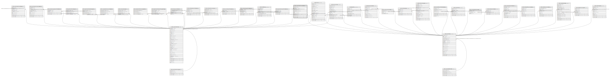

# ndb.publicationauthors

## Description

This table lists authors as their names are given in publications. Only the initials are stored for authors’ given names. The ContactID links to the author’s full name and contact data in the Contacts table. Thus, for a bibliographic entry, Charles Robert Darwin is listed as C. R. Darwin, or as C. Darwin if the publication did not include his middle name. Book editors are also stored in this table if the entire book is cited. However, if a book chapter or section is cited, authors are stored in this table, but the book editors are stored in the PublicationEditors table. Thus, for the following reference, G. C. Frison is stored in the PublicationAuthors table.  
Frison, G. C., editor. 1996. The Mill Iron site. University of New Mexico Press, Albuquerque, New Mexico, USA.  
Whereas for the following publication, L. S. Cummings is listed in the PublicationAuthors table, and G. C. Frison is listed in the PublicationEditors table.  
Cummings, L. S. 1996. Paleoenvironmental interpretations for the Mill Iron site: stratigraphic pollen and phyrolith analysis. Pages 177-193 in G. C. Frison, editor. The Mill Iron site. University of New Mexico Press, Albuquerque, New Mexico, USA.

## Columns

| # | Name            | Type                           | Default                                                  | Nullable | Children | Parents                                 | Comment                                                                                              |
| - | --------------- | ------------------------------ | -------------------------------------------------------- | -------- | -------- | --------------------------------------- | ---------------------------------------------------------------------------------------------------- |
| 1 | authorid        | integer                        | nextval('ndb.seq_publicationauthors_authorid'::regclass) | false    |          |                                         | An arbitrary Author identification number.                                                           |
| 2 | authororder     | integer                        |                                                          | true     |          |                                         | Ordinal number for the position in which the author’s name appears in the publication’s author list. |
| 3 | contactid       | integer                        |                                                          | true     |          | [ndb.contacts](ndb.contacts.md)         | Contact identification number. Field links to the Contacts table.                                    |
| 4 | familyname      | varchar(80)                    |                                                          | true     |          |                                         | Family name of author                                                                                |
| 5 | initials        | varchar(8)                     |                                                          | true     |          |                                         | Initials of author’s given names                                                                     |
| 6 | publicationid   | integer                        |                                                          | false    |          | [ndb.publications](ndb.publications.md) | Publication identification number. Field links to the Publications table.                            |
| 7 | recdatecreated  | timestamp(0) without time zone | timezone('UTC'::text, now())                             | false    |          |                                         |                                                                                                      |
| 8 | recdatemodified | timestamp(0) without time zone |                                                          | false    |          |                                         |                                                                                                      |
| 9 | suffix          | varchar(8)                     |                                                          | true     |          |                                         | Authors suffix (e.g. «Jr.»)                                                                          |

## Viewpoints

| Name                                     | Definition                                                       |
| ---------------------------------------- | ---------------------------------------------------------------- |
| [Contact related tables](viewpoint-4.md) | Tables that relate to people, or are connected to the contactid. |

## Constraints

| # | Name                               | Type        | Definition                                                                                                 |
| - | ---------------------------------- | ----------- | ---------------------------------------------------------------------------------------------------------- |
| 1 | fk_publicationauthors_contacts     | FOREIGN KEY | FOREIGN KEY (contactid) REFERENCES ndb.contacts(contactid) ON UPDATE CASCADE                               |
| 2 | fk_publicationauthors_publications | FOREIGN KEY | FOREIGN KEY (publicationid) REFERENCES ndb.publications(publicationid) ON UPDATE CASCADE ON DELETE CASCADE |
| 3 | publicationauthors_pkey            | PRIMARY KEY | PRIMARY KEY (authorid)                                                                                     |

## Indexes

| # | Name                                | Definition                                                                                                                    |
| - | ----------------------------------- | ----------------------------------------------------------------------------------------------------------------------------- |
| 1 | ix_contactid_publicationauthors     | CREATE INDEX ix_contactid_publicationauthors ON ndb.publicationauthors USING btree (contactid) WITH (fillfactor='10')         |
| 2 | ix_publicationid_publicationauthors | CREATE INDEX ix_publicationid_publicationauthors ON ndb.publicationauthors USING btree (publicationid) WITH (fillfactor='10') |
| 3 | publicationauthors_pkey             | CREATE UNIQUE INDEX publicationauthors_pkey ON ndb.publicationauthors USING btree (authorid)                                  |

## Triggers

| # | Name                | Definition                                                                                                                                      |
| - | ------------------- | ----------------------------------------------------------------------------------------------------------------------------------------------- |
| 1 | tr_sites_modifydate | CREATE TRIGGER tr_sites_modifydate BEFORE INSERT OR UPDATE ON ndb.publicationauthors FOR EACH ROW EXECUTE FUNCTION ndb.update_recdatemodified() |

## Relations

---

> Generated by [tbls](https://github.com/k1LoW/tbls)