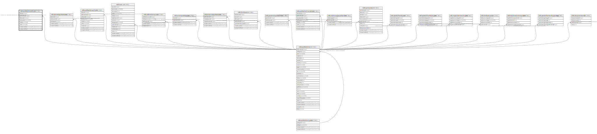

# ndb.publicationeditors

## Description

This table stores the editors of publications for which chapters or sections are the primary bibliographic entries. Chapter authors are stored in the PublicatonAuthors table, where they are linked to the Contacts table. However, publication editors are not cross-referenced in the Contacts table, because chapter authors are the principal citation.

## Columns

| # | Name            | Type                           | Default                                                  | Nullable | Children | Parents                                 | Comment                                                                                              |
| - | --------------- | ------------------------------ | -------------------------------------------------------- | -------- | -------- | --------------------------------------- | ---------------------------------------------------------------------------------------------------- |
| 1 | editorid        | integer                        | nextval('ndb.seq_publicationeditors_editorid'::regclass) | false    |          |                                         | An arbitrary Editor identification number.                                                           |
| 2 | editororder     | integer                        |                                                          | true     |          |                                         | Ordinal number for the position in which the editor’s name appears in the publication’s author list. |
| 3 | familyname      | varchar(64)                    |                                                          | true     |          |                                         | Family name of editor                                                                                |
| 4 | initials        | varchar(8)                     |                                                          | true     |          |                                         | Initials of editor’s given names                                                                     |
| 5 | publicationid   | integer                        |                                                          | false    |          | [ndb.publications](ndb.publications.md) | Publication identification number. Field links to the Publications table.                            |
| 6 | recdatecreated  | timestamp(0) without time zone | timezone('UTC'::text, now())                             | false    |          |                                         |                                                                                                      |
| 7 | recdatemodified | timestamp(0) without time zone |                                                          | false    |          |                                         |                                                                                                      |
| 8 | suffix          | varchar(8)                     |                                                          | true     |          |                                         | Authors suffix (e.g. «Jr.»)                                                                          |

## Constraints

| # | Name                               | Type        | Definition                                                                                                 |
| - | ---------------------------------- | ----------- | ---------------------------------------------------------------------------------------------------------- |
| 1 | fk_publicationeditors_publications | FOREIGN KEY | FOREIGN KEY (publicationid) REFERENCES ndb.publications(publicationid) ON UPDATE CASCADE ON DELETE CASCADE |
| 2 | publicationeditors_pkey            | PRIMARY KEY | PRIMARY KEY (editorid)                                                                                     |

## Indexes

| # | Name                                | Definition                                                                                                                    |
| - | ----------------------------------- | ----------------------------------------------------------------------------------------------------------------------------- |
| 1 | ix_publicationid_publicationeditors | CREATE INDEX ix_publicationid_publicationeditors ON ndb.publicationeditors USING btree (publicationid) WITH (fillfactor='10') |
| 2 | publicationeditors_pkey             | CREATE UNIQUE INDEX publicationeditors_pkey ON ndb.publicationeditors USING btree (editorid)                                  |

## Triggers

| # | Name                | Definition                                                                                                                                      |
| - | ------------------- | ----------------------------------------------------------------------------------------------------------------------------------------------- |
| 1 | tr_sites_modifydate | CREATE TRIGGER tr_sites_modifydate BEFORE INSERT OR UPDATE ON ndb.publicationeditors FOR EACH ROW EXECUTE FUNCTION ndb.update_recdatemodified() |

## Relations

---

> Generated by [tbls](https://github.com/k1LoW/tbls)