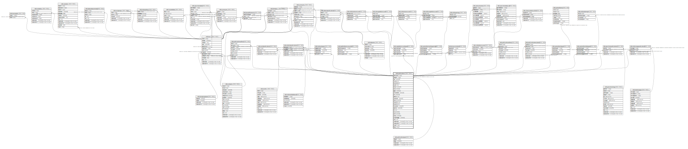

# ndb.publications

## Description

This table stores publication or bibliographic data. The table is designed with fields for bibliographic data so that bibliographies can be formatted in different styles and potentially exported to bibliographic software such EndNote®. In the constituent databases that were originally merged into Neotoma, bibliographic entries were not parsed into separate fields, but rather were stored as free-form text. Because complete parsing of these thousands of legacy bibliographic entries into individual fields would have been prohibitively time consuming, the existing bibliographic data were ingested “as is” with a PubTypeID = Other. However, for legacy publications, the year of publication was added to the Year field, and authors were parsed into the PublicationAuthors table and added to the Contacts table. In addition, some global changes were made. For example, «Pp.» was changed to «Pages», «Ed.» to «Editor», and «Eds.» to «Editors». Also for FAUNMAP entries, abbreviated journal names were changed to fully spelled out names.  
The merged databases used different bibliographic styles, and data entry personnel working on the same database sometimes followed different conventions. Consequently, the current bibliographic entries are not stylistically uniform. Eventually, the legacy bibliographic data will be parsed into separate fields.  
The Publications table has fields to accommodate a number of different types of publications. Some fields contain different kinds of data for different kinds of publications. For example, the BookTitle field stores the titles of books, but stores the journal name for journal articles. The Publisher field stores the name of the publisher for books, but the name of the university for theses and dissertations.  
Authors are stored in the PublicationAuthors table. Editors are also stored in the PublicationAuthors table if the entire publication is cited. The PublicationAuthors table has a ContactID field, which links to the Contacts table, where full names and contact information is stored for authors and editors. The PubTypeID «Authored Book» or «Edited Book» indicates whether the Publication Authors records are authors or editors. If a book chapter or section is the primary bibliographic entry, then the book editors are stored in the PublicationEditors table, which does not have a ContactID field.

## Columns

| #  | Name             | Type                           | Default                                                 | Nullable | Children                                                                                                                                                                                                                                                                                                                                                                                                                                                                                                                                                                                                                                                                                                                                                                                                                                                                                                    | Parents                                         | Comment                                                                                                                                                                                                                                                                                                                                                                                                                                                                                                                                                                                                                                                                                                                                                                                                                                                                                                                                                                                                                            |
| -- | ---------------- | ------------------------------ | ------------------------------------------------------- | -------- | ----------------------------------------------------------------------------------------------------------------------------------------------------------------------------------------------------------------------------------------------------------------------------------------------------------------------------------------------------------------------------------------------------------------------------------------------------------------------------------------------------------------------------------------------------------------------------------------------------------------------------------------------------------------------------------------------------------------------------------------------------------------------------------------------------------------------------------------------------------------------------------------------------------- | ----------------------------------------------- | ---------------------------------------------------------------------------------------------------------------------------------------------------------------------------------------------------------------------------------------------------------------------------------------------------------------------------------------------------------------------------------------------------------------------------------------------------------------------------------------------------------------------------------------------------------------------------------------------------------------------------------------------------------------------------------------------------------------------------------------------------------------------------------------------------------------------------------------------------------------------------------------------------------------------------------------------------------------------------------------------------------------------------------- |
| 1  | articletitle     | text                           |                                                         | true     |                                                                                                                                                                                                                                                                                                                                                                                                                                                                                                                                                                                                                                                                                                                                                                                                                                                                                                             |                                                 | The title of a journal or book chapter article.                                                                                                                                                                                                                                                                                                                                                                                                                                                                                                                                                                                                                                                                                                                                                                                                                                                                                                                                                                                    |
| 2  | bibtex           | varchar                        |                                                         | true     |                                                                                                                                                                                                                                                                                                                                                                                                                                                                                                                                                                                                                                                                                                                                                                                                                                                                                                             |                                                 |                                                                                                                                                                                                                                                                                                                                                                                                                                                                                                                                                                                                                                                                                                                                                                                                                                                                                                                                                                                                                                    |
| 3  | booktitle        | text                           |                                                         | true     |                                                                                                                                                                                                                                                                                                                                                                                                                                                                                                                                                                                                                                                                                                                                                                                                                                                                                                             |                                                 | The title of a book or journal                                                                                                                                                                                                                                                                                                                                                                                                                                                                                                                                                                                                                                                                                                                                                                                                                                                                                                                                                                                                     |
| 4  | citation         | text                           |                                                         | true     |                                                                                                                                                                                                                                                                                                                                                                                                                                                                                                                                                                                                                                                                                                                                                                                                                                                                                                             |                                                 | The complete citation in a standard style. For Legacy citations inherited from other databases, this field holds the citation as ingested from the other databases                                                                                                                                                                                                                                                                                                                                                                                                                                                                                                                                                                                                                                                                                                                                                                                                                                                                 |
| 5  | citationnumber   | varchar(24)                    |                                                         | true     |                                                                                                                                                                                                                                                                                                                                                                                                                                                                                                                                                                                                                                                                                                                                                                                                                                                                                                             |                                                 | A citation or article number used in lieu of page numbers for digital or online publications, typically used in conjunction with the DOI. For example, journals published by the American Geophysical Union since 1999 use citation numbers rather than page numbers.                                                                                                                                                                                                                                                                                                                                                                                                                                                                                                                                                                                                                                                                                                                                                              |
| 6  | city             | varchar(64)                    |                                                         | true     |                                                                                                                                                                                                                                                                                                                                                                                                                                                                                                                                                                                                                                                                                                                                                                                                                                                                                                             |                                                 | City in which the publication was published. The first city if a list is given.                                                                                                                                                                                                                                                                                                                                                                                                                                                                                                                                                                                                                                                                                                                                                                                                                                                                                                                                                    |
| 7  | country          | varchar(64)                    |                                                         | true     |                                                                                                                                                                                                                                                                                                                                                                                                                                                                                                                                                                                                                                                                                                                                                                                                                                                                                                             |                                                 | Country in which the publication was published, generally the complete country name, but «USA» for the United States.                                                                                                                                                                                                                                                                                                                                                                                                                                                                                                                                                                                                                                                                                                                                                                                                                                                                                                              |
| 8  | crossref         | jsonb                          |                                                         | true     |                                                                                                                                                                                                                                                                                                                                                                                                                                                                                                                                                                                                                                                                                                                                                                                                                                                                                                             |                                                 |                                                                                                                                                                                                                                                                                                                                                                                                                                                                                                                                                                                                                                                                                                                                                                                                                                                                                                                                                                                                                                    |
| 9  | doi              | varchar(128)                   |                                                         | true     |                                                                                                                                                                                                                                                                                                                                                                                                                                                                                                                                                                                                                                                                                                                                                                                                                                                                                                             |                                                 | Digital Object Identifier. A unique identifier assigned to digital publications. The DOI consists of a prefix and suffix separated by a slash. The portion before the slash stands for the publisher and is assigned by the International DOI Foundation. For example, 10.1029 is the prefix for the American Geophysical Union. The suffix is assigned by the publisher according to their protocols. For example, the DOI 10.1029/2002PA000768 is for an article submitted to Paleoceanography in 2002 and is article number 768 submitted since the system was installed. An example of CitationNumber and DOI: Barron, J. A., L. Heusser, T. Herbert, and M. Lyle. 2003. High-resolution climatic evolution of coastal northern California during the past 16,000 years, Paleoceanography 18(1):1020. DOI:10.1029/2002PA000768.                                                                                                                                                                                          |
| 10 | edition          | varchar(24)                    |                                                         | true     |                                                                                                                                                                                                                                                                                                                                                                                                                                                                                                                                                                                                                                                                                                                                                                                                                                                                                                             |                                                 | Edition of a publication.                                                                                                                                                                                                                                                                                                                                                                                                                                                                                                                                                                                                                                                                                                                                                                                                                                                                                                                                                                                                          |
| 11 | issue            | varchar(8)                     |                                                         | true     |                                                                                                                                                                                                                                                                                                                                                                                                                                                                                                                                                                                                                                                                                                                                                                                                                                                                                                             |                                                 | Journal issue number, normally included only if issues are independently paginated.                                                                                                                                                                                                                                                                                                                                                                                                                                                                                                                                                                                                                                                                                                                                                                                                                                                                                                                                                |
| 12 | journal          | text                           |                                                         | true     |                                                                                                                                                                                                                                                                                                                                                                                                                                                                                                                                                                                                                                                                                                                                                                                                                                                                                                             |                                                 |                                                                                                                                                                                                                                                                                                                                                                                                                                                                                                                                                                                                                                                                                                                                                                                                                                                                                                                                                                                                                                    |
| 13 | notes            | text                           |                                                         | true     |                                                                                                                                                                                                                                                                                                                                                                                                                                                                                                                                                                                                                                                                                                                                                                                                                                                                                                             |                                                 | Free form notes or comments about the publication, which may be added parenthetically to the citation.                                                                                                                                                                                                                                                                                                                                                                                                                                                                                                                                                                                                                                                                                                                                                                                                                                                                                                                             |
| 14 | numvolumes       | varchar(8)                     |                                                         | true     |                                                                                                                                                                                                                                                                                                                                                                                                                                                                                                                                                                                                                                                                                                                                                                                                                                                                                                             |                                                 | Number of volumes in a set of books. Used when the entire set is referenced. An example of NumVolumes and Edition: Wilson, D. E., and D. M. Reeder. 2005. Mammal species of the world: a taxonomic and geographic reference. Third edition. 2 volumes. The Johns Hopkins University Press, Baltimore, Maryland, USA.                                                                                                                                                                                                                                                                                                                                                                                                                                                                                                                                                                                                                                                                                                         |
| 15 | originallanguage | varchar(64)                    |                                                         | true     |                                                                                                                                                                                                                                                                                                                                                                                                                                                                                                                                                                                                                                                                                                                                                                                                                                                                                                             |                                                 | The original language if the publication or bibliographic citation is translated from another language or transliterated from a non-Latin character set. Field not needed for non-translated publications in languages using the Latin character set. In the following example, the ArticleTitle is translated from Russian to English and the BookTitle (journal name) is transliterated from Russian: Tarasov, P.E. 1991. Late Holocene features of the Kokchetav Highland. Vestnik Moskovskogo Universiteta. Series 5. Geography 6:54-60 [in Russian].                                                                                                                                                                                                                                                                                                                                                                                                                                                                    |
| 16 | pages            | varchar(24)                    |                                                         | true     |                                                                                                                                                                                                                                                                                                                                                                                                                                                                                                                                                                                                                                                                                                                                                                                                                                                                                                             |                                                 | Page numbers for journal or book chapter articles, or the number of pages in theses, dissertations, and reports.                                                                                                                                                                                                                                                                                                                                                                                                                                                                                                                                                                                                                                                                                                                                                                                                                                                                                                                   |
| 17 | publicationid    | integer                        | nextval('ndb.seq_publications_publicationid'::regclass) | false    | [ndb.calibrationcurves](ndb.calibrationcurves.md) [ndb.datasetpublications](ndb.datasetpublications.md) [ndb.decayconstants](ndb.decayconstants.md) [ndb.depthreferencesystem](ndb.depthreferencesystem.md) [ndb.eventpublications](ndb.eventpublications.md) [ndb.externalpublications](ndb.externalpublications.md) [ndb.formtaxa](ndb.formtaxa.md) [ndb.geochronpublications](ndb.geochronpublications.md) [ndb.landusetypes](ndb.landusetypes.md) [ndb.publicationauthors](ndb.publicationauthors.md) [ndb.publicationeditors](ndb.publicationeditors.md) [ndb.publicationtranslators](ndb.publicationtranslators.md) [ndb.relativeagepublications](ndb.relativeagepublications.md) [ndb.speleothemdriptypes](ndb.speleothemdriptypes.md) [ndb.speleothemtypes](ndb.speleothemtypes.md) [ndb.synonymy](ndb.synonymy.md) [ndb.taxa](ndb.taxa.md) [ndb.vegetationcovertypes](ndb.vegetationcovertypes.md) |                                                 | An arbitrary Publication identification number.                                                                                                                                                                                                                                                                                                                                                                                                                                                                                                                                                                                                                                                                                                                                                                                                                                                                                                                                                                                    |
| 18 | publisher        | varchar(255)                   |                                                         | true     |                                                                                                                                                                                                                                                                                                                                                                                                                                                                                                                                                                                                                                                                                                                                                                                                                                                                                                             |                                                 | Publisher, including commercial publishing houses, university presses, government agencies, and non-governmental organizations, generally the owner of the copyright.                                                                                                                                                                                                                                                                                                                                                                                                                                                                                                                                                                                                                                                                                                                                                                                                                                                              |
| 19 | pubtypeid        | integer                        |                                                         | true     |                                                                                                                                                                                                                                                                                                                                                                                                                                                                                                                                                                                                                                                                                                                                                                                                                                                                                                             | [ndb.publicationtypes](ndb.publicationtypes.md) | Publication type. Field links to the PublicationTypes lookup table.                                                                                                                                                                                                                                                                                                                                                                                                                                                                                                                                                                                                                                                                                                                                                                                                                                                                                                                                                                |
| 20 | recdatecreated   | timestamp(0) without time zone | timezone('UTC'::text, now())                            | false    |                                                                                                                                                                                                                                                                                                                                                                                                                                                                                                                                                                                                                                                                                                                                                                                                                                                                                                             |                                                 |                                                                                                                                                                                                                                                                                                                                                                                                                                                                                                                                                                                                                                                                                                                                                                                                                                                                                                                                                                                                                                    |
| 21 | recdatemodified  | timestamp(0) without time zone |                                                         | false    |                                                                                                                                                                                                                                                                                                                                                                                                                                                                                                                                                                                                                                                                                                                                                                                                                                                                                                             |                                                 |                                                                                                                                                                                                                                                                                                                                                                                                                                                                                                                                                                                                                                                                                                                                                                                                                                                                                                                                                                                                                                    |
| 22 | seriestitle      | text                           |                                                         | true     |                                                                                                                                                                                                                                                                                                                                                                                                                                                                                                                                                                                                                                                                                                                                                                                                                                                                                                             |                                                 | Title of a book series. Book series consist of a series of books, typically published at irregular intervals on sometimes related but different topics. The number of volumes in a series is typically open ended. Book series are often assigned ISSN numbers as well as ISBN numbers. However, in contrast to most serials, book series have individual titles and authors or editors. Citation practices for book series vary; sometimes they are cited as books, other times as journals. The default citation for Neotoma includes all information. An example of SeriesTitle and SeriesVolume: Curtis, J. H., and D. A. Hodell. 1993. An isotopic and trace element study of ostracods from Lake Miragoane, Haiti: A 10,500 year record of paleosalinity and paleotemperature changes in the Caribbean. Pages 135-152 in P. K. Swart, K. C. Lohmann, J. McKensie, and S. Savin, editors. Climate change in continental isotopic records. Geophysical Monograph 78. American Geophysical Union, Washington, D.C., USA.  |
| 23 | seriesvolume     | varchar(24)                    |                                                         | true     |                                                                                                                                                                                                                                                                                                                                                                                                                                                                                                                                                                                                                                                                                                                                                                                                                                                                                                             |                                                 | Volume number in a series.                                                                                                                                                                                                                                                                                                                                                                                                                                                                                                                                                                                                                                                                                                                                                                                                                                                                                                                                                                                                         |
| 24 | state            | varchar(64)                    |                                                         | true     |                                                                                                                                                                                                                                                                                                                                                                                                                                                                                                                                                                                                                                                                                                                                                                                                                                                                                                             |                                                 | State or province in which the publication was published. Used for the United States and Canada, not used for many countries.                                                                                                                                                                                                                                                                                                                                                                                                                                                                                                                                                                                                                                                                                                                                                                                                                                                                                                      |
| 25 | url              | text                           |                                                         | true     |                                                                                                                                                                                                                                                                                                                                                                                                                                                                                                                                                                                                                                                                                                                                                                                                                                                                                                             |                                                 |                                                                                                                                                                                                                                                                                                                                                                                                                                                                                                                                                                                                                                                                                                                                                                                                                                                                                                                                                                                                                                    |
| 26 | volume           | varchar(16)                    |                                                         | true     |                                                                                                                                                                                                                                                                                                                                                                                                                                                                                                                                                                                                                                                                                                                                                                                                                                                                                                             |                                                 | The volume number of a journal or the volume number of a book in a set. A set of books is comprised of a fixed number of volumes and normally have ISBN numbers, not ISSN numbers. Book sets are often published simultaneously, but not necessarily. For instance, many floras, such as The Flora of North America north of Mexico and Flora Europaea, consist of a set number of volumes planned in advance but published over a period of years.                                                                                                                                                                                                                                                                                                                                                                                                                                                                                                                                                                                |
| 27 | volumetitle      | text                           |                                                         | true     |                                                                                                                                                                                                                                                                                                                                                                                                                                                                                                                                                                                                                                                                                                                                                                                                                                                                                                             |                                                 | Title of a book volume in a set. Used if the individual volume is referenced. Example of Volume and VolumeTitle: Flora of North America Editorial Committee. 2002. Flora of North America north of Mexico. Volume 26. Magnoliophyta: Liliidae: Liliales and Orchidales. Oxford University Press, New York, New York, USA.                                                                                                                                                                                                                                                                                                                                                                                                                                                                                                                                                                                                                                                                                                    |
| 28 | year             | varchar(64)                    |                                                         | true     |                                                                                                                                                                                                                                                                                                                                                                                                                                                                                                                                                                                                                                                                                                                                                                                                                                                                                                             |                                                 | Year of publication.                                                                                                                                                                                                                                                                                                                                                                                                                                                                                                                                                                                                                                                                                                                                                                                                                                                                                                                                                                                                               |

## Constraints

| # | Name              | Type        | Definition                                                         |
| - | ----------------- | ----------- | ------------------------------------------------------------------ |
| 1 | pub_pty           | FOREIGN KEY | FOREIGN KEY (pubtypeid) REFERENCES ndb.publicationtypes(pubtypeid) |
| 2 | publications_pkey | PRIMARY KEY | PRIMARY KEY (publicationid)                                        |

## Indexes

| # | Name              | Definition                                                                            |
| - | ----------------- | ------------------------------------------------------------------------------------- |
| 1 | publications_pkey | CREATE UNIQUE INDEX publications_pkey ON ndb.publications USING btree (publicationid) |

## Triggers

| # | Name                | Definition                                                                                                                                |
| - | ------------------- | ----------------------------------------------------------------------------------------------------------------------------------------- |
| 1 | tr_sites_modifydate | CREATE TRIGGER tr_sites_modifydate BEFORE INSERT OR UPDATE ON ndb.publications FOR EACH ROW EXECUTE FUNCTION ndb.update_recdatemodified() |

## Relations

---

> Generated by [tbls](https://github.com/k1LoW/tbls)