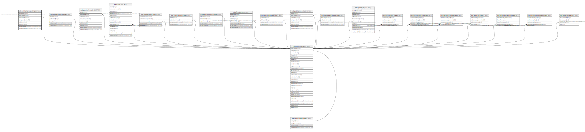

# ndb.publicationtranslators

## Description

## Columns

| # | Name            | Type                           | Default                                                          | Nullable | Children | Parents                                 | Comment |
| - | --------------- | ------------------------------ | ---------------------------------------------------------------- | -------- | -------- | --------------------------------------- | ------- |
| 1 | translatorid    | integer                        | nextval('ndb.seq_publicationtranslators_translatorid'::regclass) | false    |          |                                         |         |
| 2 | publicationid   | integer                        |                                                                  | false    |          | [ndb.publications](ndb.publications.md) |         |
| 3 | translatororder | integer                        |                                                                  | true     |          |                                         |         |
| 4 | familyname      | varchar(64)                    |                                                                  | true     |          |                                         |         |
| 5 | initials        | varchar(8)                     |                                                                  | true     |          |                                         |         |
| 6 | suffix          | varchar(8)                     |                                                                  | true     |          |                                         |         |
| 7 | recdatecreated  | timestamp(0) without time zone | timezone('UTC'::text, now())                                     | false    |          |                                         |         |
| 8 | recdatemodified | timestamp(0) without time zone |                                                                  | false    |          |                                         |         |

## Constraints

| # | Name                                   | Type        | Definition                                                                                                 |
| - | -------------------------------------- | ----------- | ---------------------------------------------------------------------------------------------------------- |
| 1 | fk_publicationtranslators_publications | FOREIGN KEY | FOREIGN KEY (publicationid) REFERENCES ndb.publications(publicationid) ON UPDATE CASCADE ON DELETE CASCADE |
| 2 | publicationtranslators_pkey            | PRIMARY KEY | PRIMARY KEY (translatorid)                                                                                 |

## Indexes

| # | Name                        | Definition                                                                                               |
| - | --------------------------- | -------------------------------------------------------------------------------------------------------- |
| 1 | publicationtranslators_pkey | CREATE UNIQUE INDEX publicationtranslators_pkey ON ndb.publicationtranslators USING btree (translatorid) |

## Triggers

| # | Name                | Definition                                                                                                                                          |
| - | ------------------- | --------------------------------------------------------------------------------------------------------------------------------------------------- |
| 1 | tr_sites_modifydate | CREATE TRIGGER tr_sites_modifydate BEFORE INSERT OR UPDATE ON ndb.publicationtranslators FOR EACH ROW EXECUTE FUNCTION ndb.update_recdatemodified() |

## Relations

---

> Generated by [tbls](https://github.com/k1LoW/tbls)