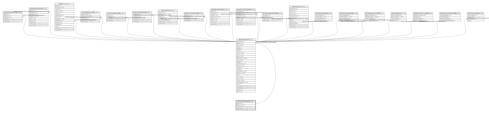

# ndb.publicationtypes

## Description

Lookup table of Publication Types. This table is referenced by the Publications table.

## Columns

| # | Name            | Type                           | Default                                                 | Nullable | Children                                | Parents | Comment                                              |
| - | --------------- | ------------------------------ | ------------------------------------------------------- | -------- | --------------------------------------- | ------- | ---------------------------------------------------- |
| 1 | pubtypeid       | integer                        | nextval('ndb.seq_publicationtypes_pubtypeid'::regclass) | false    | [ndb.publications](ndb.publications.md) |         | An arbitrary Publication Type identification number. |
| 2 | pubtype         | varchar(24)                    |                                                         | false    |                                         |         |                                                      |
| 3 | recdatecreated  | timestamp(0) without time zone | timezone('UTC'::text, now())                            | false    |                                         |         |                                                      |
| 4 | recdatemodified | timestamp(0) without time zone |                                                         | false    |                                         |         |                                                      |

## Constraints

| # | Name                  | Type        | Definition              |
| - | --------------------- | ----------- | ----------------------- |
| 1 | publicationtypes_pkey | PRIMARY KEY | PRIMARY KEY (pubtypeid) |

## Indexes

| # | Name                  | Definition                                                                                |
| - | --------------------- | ----------------------------------------------------------------------------------------- |
| 1 | publicationtypes_pkey | CREATE UNIQUE INDEX publicationtypes_pkey ON ndb.publicationtypes USING btree (pubtypeid) |

## Triggers

| # | Name                | Definition                                                                                                                                    |
| - | ------------------- | --------------------------------------------------------------------------------------------------------------------------------------------- |
| 1 | tr_sites_modifydate | CREATE TRIGGER tr_sites_modifydate BEFORE INSERT OR UPDATE ON ndb.publicationtypes FOR EACH ROW EXECUTE FUNCTION ndb.update_recdatemodified() |

## Relations

---

> Generated by [tbls](https://github.com/k1LoW/tbls)