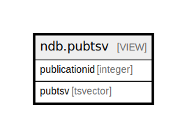

# ndb.pubtsv

## Description

<details>
<summary><strong>Table Definition</strong></summary>

```sql
CREATE VIEW pubtsv AS (
 SELECT pu.publicationid,
    (((((setweight(to_tsvector(COALESCE(pu.articletitle, ''::text)), 'A'::"char") || setweight(to_tsvector(COALESCE(pu.booktitle, ''::text)), 'A'::"char")) || setweight(to_tsvector(COALESCE(pu.journal, ''::text)), 'B'::"char")) || setweight(to_tsvector(COALESCE(pu.seriestitle, ''::text)), 'B'::"char")) || setweight(to_tsvector(COALESCE(pu.volumetitle, ''::text)), 'B'::"char")) || setweight(to_tsvector(COALESCE(pu.citation, ''::text)), 'C'::"char")) AS pubtsv
   FROM ndb.publications pu
)
```

</details>

## Columns

| # | Name          | Type     | Default | Nullable | Children | Parents | Comment |
| - | ------------- | -------- | ------- | -------- | -------- | ------- | ------- |
| 1 | publicationid | integer  |         | true     |          |         |         |
| 2 | pubtsv        | tsvector |         | true     |          |         |         |

## Referenced Tables

| # | # | Name                                    | Columns | Comment                                                                                                                                                                                                                                                                                                                                                                                                                                                                                                                                                                                                                                                                                                                                                                                                                                                                                                                                                                                                                                                                                                                                                                                                                                                                                                                                                                                                                                                                                                                                                                                                                                                                                                                                                                                                                                                                                                                                                                                                                                                                                                                                                                                                                                                                                                                                                                                                                                                       | Type       |
| - | - | --------------------------------------- | ------- | ------------------------------------------------------------------------------------------------------------------------------------------------------------------------------------------------------------------------------------------------------------------------------------------------------------------------------------------------------------------------------------------------------------------------------------------------------------------------------------------------------------------------------------------------------------------------------------------------------------------------------------------------------------------------------------------------------------------------------------------------------------------------------------------------------------------------------------------------------------------------------------------------------------------------------------------------------------------------------------------------------------------------------------------------------------------------------------------------------------------------------------------------------------------------------------------------------------------------------------------------------------------------------------------------------------------------------------------------------------------------------------------------------------------------------------------------------------------------------------------------------------------------------------------------------------------------------------------------------------------------------------------------------------------------------------------------------------------------------------------------------------------------------------------------------------------------------------------------------------------------------------------------------------------------------------------------------------------------------------------------------------------------------------------------------------------------------------------------------------------------------------------------------------------------------------------------------------------------------------------------------------------------------------------------------------------------------------------------------------------------------------------------------------------------------------------------------------- | ---------- |
| 1 | 1 | [ndb.publications](ndb.publications.md) | 28      | This table stores publication or bibliographic data. The table is designed with fields for bibliographic data so that bibliographies can be formatted in different styles and potentially exported to bibliographic software such EndNote®. In the constituent databases that were originally merged into Neotoma, bibliographic entries were not parsed into separate fields, but rather were stored as free-form text. Because complete parsing of these thousands of legacy bibliographic entries into individual fields would have been prohibitively time consuming, the existing bibliographic data were ingested “as is” with a PubTypeID = Other. However, for legacy publications, the year of publication was added to the Year field, and authors were parsed into the PublicationAuthors table and added to the Contacts table. In addition, some global changes were made. For example, «Pp.» was changed to «Pages», «Ed.» to «Editor», and «Eds.» to «Editors». Also for FAUNMAP entries, abbreviated journal names were changed to fully spelled out names.<br>The merged databases used different bibliographic styles, and data entry personnel working on the same database sometimes followed different conventions. Consequently, the current bibliographic entries are not stylistically uniform. Eventually, the legacy bibliographic data will be parsed into separate fields.<br>The Publications table has fields to accommodate a number of different types of publications. Some fields contain different kinds of data for different kinds of publications. For example, the BookTitle field stores the titles of books, but stores the journal name for journal articles. The Publisher field stores the name of the publisher for books, but the name of the university for theses and dissertations.<br>Authors are stored in the PublicationAuthors table. Editors are also stored in the PublicationAuthors table if the entire publication is cited. The PublicationAuthors table has a ContactID field, which links to the Contacts table, where full names and contact information is stored for authors and editors. The PubTypeID «Authored Book» or «Edited Book» indicates whether the Publication Authors records are authors or editors. If a book chapter or section is the primary bibliographic entry, then the book editors are stored in the PublicationEditors table, which does not have a ContactID field. | BASE TABLE |

## Relations



---

> Generated by [tbls](https://github.com/k1LoW/tbls)