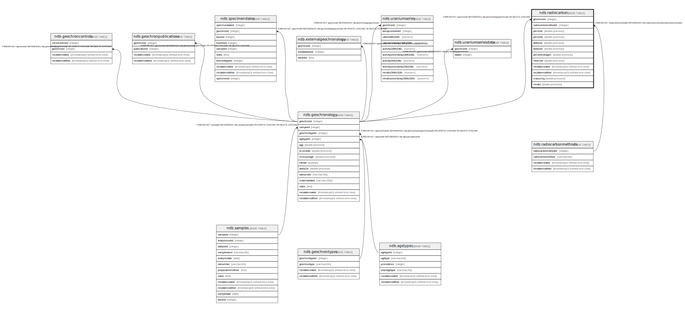

# ndb.radiocarbon

## Description

## Columns

| #  | Name                | Type                           | Default                      | Nullable | Children | Parents                                             | Comment |
| -- | ------------------- | ------------------------------ | ---------------------------- | -------- | -------- | --------------------------------------------------- | ------- |
| 1  | geochronid          | integer                        |                              | false    |          | [ndb.geochronology](ndb.geochronology.md)           |         |
| 2  | radiocarbonmethodid | integer                        |                              | true     |          | [ndb.radiocarbonmethods](ndb.radiocarbonmethods.md) |         |
| 3  | percentc            | double precision               |                              | true     |          |                                                     |         |
| 4  | percentn            | double precision               |                              | true     |          |                                                     |         |
| 5  | delta13c            | double precision               |                              | true     |          |                                                     |         |
| 6  | delta15n            | double precision               |                              | true     |          |                                                     |         |
| 7  | percentcollagen     | double precision               |                              | true     |          |                                                     |         |
| 8  | reservoir           | double precision               |                              | true     |          |                                                     |         |
| 9  | recdatecreated      | timestamp(0) without time zone | timezone('UTC'::text, now()) | false    |          |                                                     |         |
| 10 | recdatemodified     | timestamp(0) without time zone |                              | false    |          |                                                     |         |
| 11 | masscmg             | double precision               |                              | true     |          |                                                     |         |
| 12 | cnratio             | double precision               |                              | true     |          |                                                     |         |

## Constraints

| # | Name                    | Type        | Definition                                                                               |
| - | ----------------------- | ----------- | ---------------------------------------------------------------------------------------- |
| 1 | fk_geochrons_geochronid | FOREIGN KEY | FOREIGN KEY (geochronid) REFERENCES ndb.geochronology(geochronid) ON DELETE CASCADE      |
| 2 | radiocarbon_pkey        | PRIMARY KEY | PRIMARY KEY (geochronid)                                                                 |
| 3 | fk_radiocarbonmethodid  | FOREIGN KEY | FOREIGN KEY (radiocarbonmethodid) REFERENCES ndb.radiocarbonmethods(radiocarbonmethodid) |
| 4 | radiocarbon_unique      | UNIQUE      | UNIQUE (geochronid)                                                                      |

## Indexes

| # | Name               | Definition                                                                         |
| - | ------------------ | ---------------------------------------------------------------------------------- |
| 1 | radiocarbon_pkey   | CREATE UNIQUE INDEX radiocarbon_pkey ON ndb.radiocarbon USING btree (geochronid)   |
| 2 | radiocarbon_unique | CREATE UNIQUE INDEX radiocarbon_unique ON ndb.radiocarbon USING btree (geochronid) |

## Triggers

| # | Name                    | Definition                                                                                                                               |
| - | ----------------------- | ---------------------------------------------------------------------------------------------------------------------------------------- |
| 1 | cnratio_compute_trigger | CREATE TRIGGER cnratio_compute_trigger BEFORE INSERT OR UPDATE ON ndb.radiocarbon FOR EACH ROW EXECUTE FUNCTION ndb.compute_cnratio()    |
| 2 | tr_sites_modifydate     | CREATE TRIGGER tr_sites_modifydate BEFORE INSERT OR UPDATE ON ndb.radiocarbon FOR EACH ROW EXECUTE FUNCTION ndb.update_recdatemodified() |

## Relations

---

> Generated by [tbls](https://github.com/k1LoW/tbls)