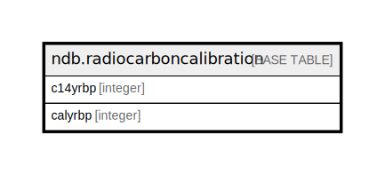

# ndb.radiocarboncalibration

## Description

Radiocarbon calibration table. This table is intended for quick calibration of age-model radiocarbon dates. These calibrated dates are for perusal and data exploration only. Please see Section 2.5 for a full discussion.

## Columns

| # | Name    | Type    | Default | Nullable | Children | Parents | Comment                                                                        |
| - | ------- | ------- | ------- | -------- | -------- | ------- | ------------------------------------------------------------------------------ |
| 1 | c14yrbp | integer |         | false    |          |         | Age in radiocarbon years BP. The range is -100 to 45,000 by 1-year increments. |
| 2 | calyrbp | integer |         | false    |          |         | Age in calibrated radiocarbon years BP.                                        |

## Constraints

| # | Name                        | Type        | Definition            |
| - | --------------------------- | ----------- | --------------------- |
| 1 | radiocarboncalibration_pkey | PRIMARY KEY | PRIMARY KEY (c14yrbp) |

## Indexes

| # | Name                        | Definition                                                                                          |
| - | --------------------------- | --------------------------------------------------------------------------------------------------- |
| 1 | radiocarboncalibration_pkey | CREATE UNIQUE INDEX radiocarboncalibration_pkey ON ndb.radiocarboncalibration USING btree (c14yrbp) |

## Relations

---

> Generated by [tbls](https://github.com/k1LoW/tbls)