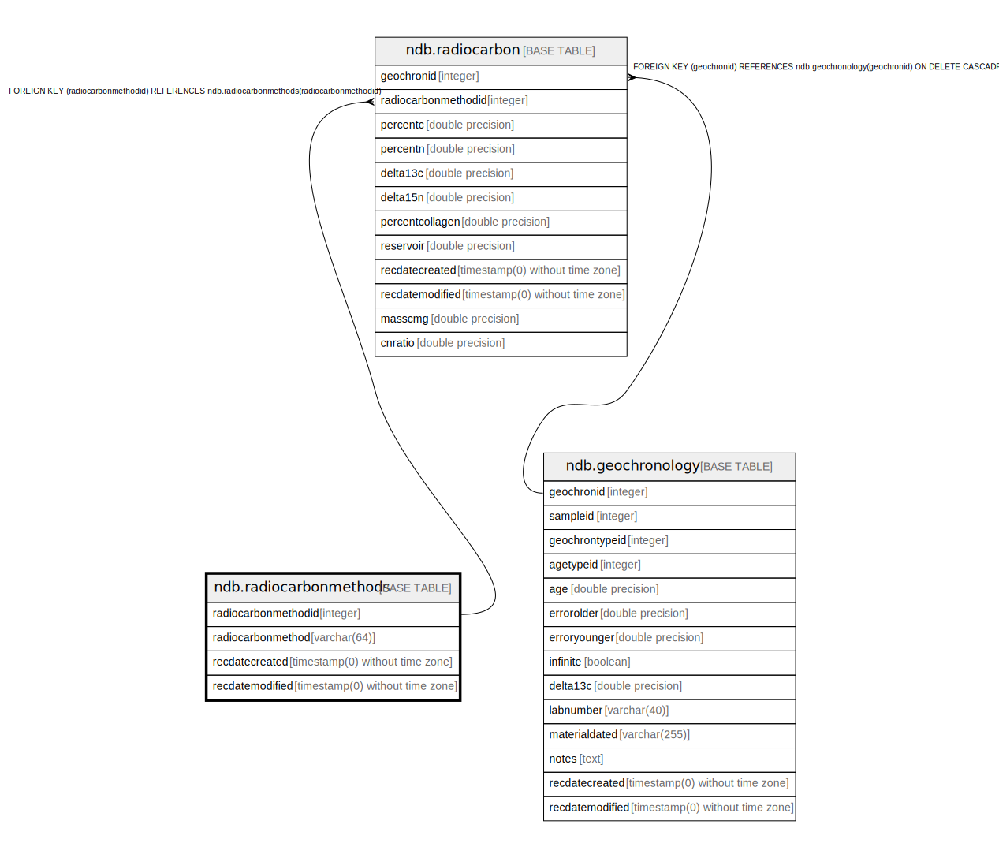

# ndb.radiocarbonmethods

## Description

## Columns

| # | Name                | Type                           | Default                                                             | Nullable | Children                              | Parents | Comment |
| - | ------------------- | ------------------------------ | ------------------------------------------------------------------- | -------- | ------------------------------------- | ------- | ------- |
| 1 | radiocarbonmethod   | varchar(64)                    |                                                                     | false    |                                       |         |         |
| 2 | radiocarbonmethodid | integer                        | nextval('ndb.seq_radiocarbonmethods_radiocarbonmethodid'::regclass) | false    | [ndb.radiocarbon](ndb.radiocarbon.md) |         |         |
| 3 | recdatecreated      | timestamp(0) without time zone | timezone('UTC'::text, now())                                        | false    |                                       |         |         |
| 4 | recdatemodified     | timestamp(0) without time zone |                                                                     | false    |                                       |         |         |

## Viewpoints

| Name                                        | Definition                                        |
| ------------------------------------------- | ------------------------------------------------- |
| [Chronology related tables](viewpoint-5.md) | Tables related to chronology and age assignments. |

## Constraints

| # | Name                    | Type        | Definition                        |
| - | ----------------------- | ----------- | --------------------------------- |
| 1 | radiocarbonmethods_pkey | PRIMARY KEY | PRIMARY KEY (radiocarbonmethodid) |

## Indexes

| # | Name                    | Definition                                                                                              |
| - | ----------------------- | ------------------------------------------------------------------------------------------------------- |
| 1 | radiocarbonmethods_pkey | CREATE UNIQUE INDEX radiocarbonmethods_pkey ON ndb.radiocarbonmethods USING btree (radiocarbonmethodid) |

## Triggers

| # | Name                | Definition                                                                                                                                      |
| - | ------------------- | ----------------------------------------------------------------------------------------------------------------------------------------------- |
| 1 | tr_sites_modifydate | CREATE TRIGGER tr_sites_modifydate BEFORE INSERT OR UPDATE ON ndb.radiocarbonmethods FOR EACH ROW EXECUTE FUNCTION ndb.update_recdatemodified() |

## Relations

---

> Generated by [tbls](https://github.com/k1LoW/tbls)