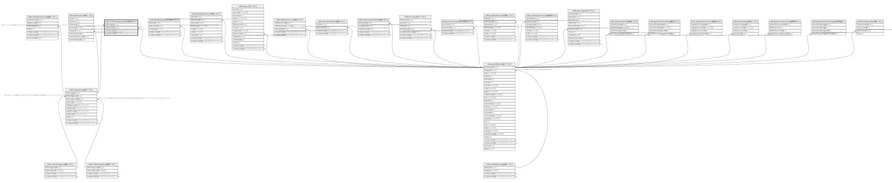

# ndb.relativeagepublications

## Description

This table stores Publications in which Relative Ages are reported for CollectionUnits.

## Columns

| # | Name            | Type                           | Default                      | Nullable | Children | Parents                                 | Comment                                                                     |
| - | --------------- | ------------------------------ | ---------------------------- | -------- | -------- | --------------------------------------- | --------------------------------------------------------------------------- |
| 1 | relativeageid   | integer                        |                              | false    |          | [ndb.relativeages](ndb.relativeages.md) | Relative Ages identification number. Field links to the RelativeAges table. |
| 2 | publicationid   | integer                        |                              | false    |          | [ndb.publications](ndb.publications.md) | Publication identification number. Field links to Publications table.       |
| 3 | recdatecreated  | timestamp(0) without time zone | timezone('UTC'::text, now()) | false    |          |                                         |                                                                             |
| 4 | recdatemodified | timestamp(0) without time zone |                              | false    |          |                                         |                                                                             |

## Constraints

| # | Name                                    | Type        | Definition                                                                                                 |
| - | --------------------------------------- | ----------- | ---------------------------------------------------------------------------------------------------------- |
| 1 | fk_relativeagepublications_publications | FOREIGN KEY | FOREIGN KEY (publicationid) REFERENCES ndb.publications(publicationid) ON UPDATE CASCADE ON DELETE CASCADE |
| 2 | relativeagepublications_pkey            | PRIMARY KEY | PRIMARY KEY (relativeageid, publicationid)                                                                 |
| 3 | fk_relativeagepublications_relativeages | FOREIGN KEY | FOREIGN KEY (relativeageid) REFERENCES ndb.relativeages(relativeageid) ON UPDATE CASCADE ON DELETE CASCADE |

## Indexes

| # | Name                                     | Definition                                                                                                                              |
| - | ---------------------------------------- | --------------------------------------------------------------------------------------------------------------------------------------- |
| 1 | relativeagepublications_pkey             | CREATE UNIQUE INDEX relativeagepublications_pkey ON ndb.relativeagepublications USING btree (relativeageid, publicationid)              |
| 2 | ix_relativeageid_relativeagepublications | CREATE INDEX ix_relativeageid_relativeagepublications ON ndb.relativeagepublications USING btree (relativeageid) WITH (fillfactor='10') |

## Triggers

| # | Name                | Definition                                                                                                                                           |
| - | ------------------- | ---------------------------------------------------------------------------------------------------------------------------------------------------- |
| 1 | tr_sites_modifydate | CREATE TRIGGER tr_sites_modifydate BEFORE INSERT OR UPDATE ON ndb.relativeagepublications FOR EACH ROW EXECUTE FUNCTION ndb.update_recdatemodified() |

## Relations

---

> Generated by [tbls](https://github.com/k1LoW/tbls)