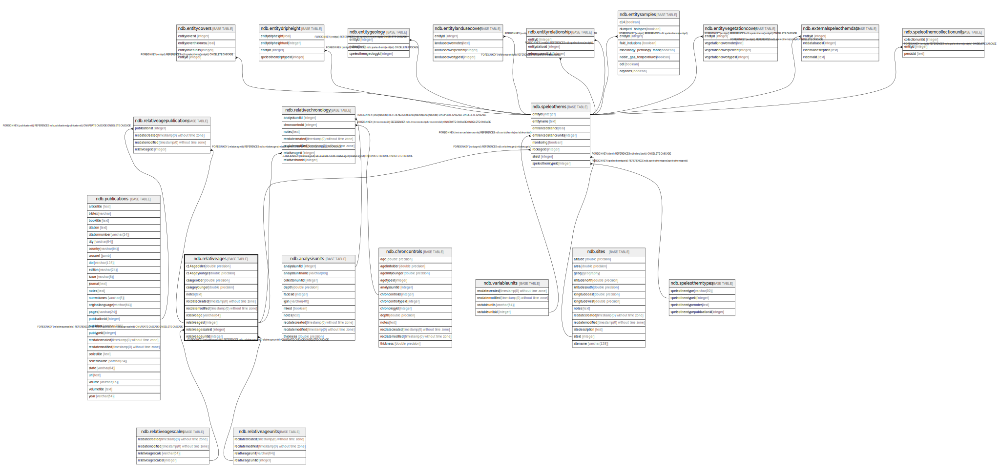

# ndb.relativeages

## Description

Lookup table of RelativeAges. Table is referenced by the RelativeChronology table.

## Columns

| #  | Name               | Type                           | Default                                                 | Nullable | Children                                                                                                                                                | Parents                                           | Comment                                                                                                                      |
| -- | ------------------ | ------------------------------ | ------------------------------------------------------- | -------- | ------------------------------------------------------------------------------------------------------------------------------------------------------- | ------------------------------------------------- | ---------------------------------------------------------------------------------------------------------------------------- |
| 1  | c14ageolder        | double precision               |                                                         | true     |                                                                                                                                                         |                                                   | Older age of the Relative Age unit in 14C yr B.P. Applies only to Relative Age units within the radiocarbon time scale.      |
| 2  | c14ageyounger      | double precision               |                                                         | true     |                                                                                                                                                         |                                                   | Younger age of the Relative Age unit in 14C yr B.P. Applies only to Relative Age units within the radiocarbon time scale.    |
| 3  | calageolder        | double precision               |                                                         | true     |                                                                                                                                                         |                                                   | Older age of the Relative age unit in calendar years.                                                                        |
| 4  | calageyounger      | double precision               |                                                         | true     |                                                                                                                                                         |                                                   | Younger age of the Relative Age unit in calendar years.                                                                      |
| 5  | notes              | text                           |                                                         | true     |                                                                                                                                                         |                                                   | Free form notes or comments about Relative Age unit.                                                                         |
| 6  | recdatecreated     | timestamp(0) without time zone | timezone('UTC'::text, now())                            | false    |                                                                                                                                                         |                                                   |                                                                                                                              |
| 7  | recdatemodified    | timestamp(0) without time zone |                                                         | false    |                                                                                                                                                         |                                                   |                                                                                                                              |
| 8  | relativeage        | varchar(64)                    |                                                         | false    |                                                                                                                                                         |                                                   | Relative Age (e.g. «Rancholabrean», a land mammal age; «MIS 11», marine isotope stage 11).                                   |
| 9  | relativeageid      | integer                        | nextval('ndb.seq_relativeages_relativeageid'::regclass) | false    | [ndb.relativeagepublications](ndb.relativeagepublications.md) [ndb.relativechronology](ndb.relativechronology.md) [ndb.speleothems](ndb.speleothems.md) |                                                   | An arbitrary Relative Age identification number.                                                                             |
| 10 | relativeagescaleid | integer                        |                                                         | false    |                                                                                                                                                         | [ndb.relativeagescales](ndb.relativeagescales.md) | Relative Age Scale (e.g. «Geologic time scale», «Marine isotope stages»). Field links to the RelativeAgeScales lookup table. |
| 11 | relativeageunitid  | integer                        |                                                         | false    |                                                                                                                                                         | [ndb.relativeageunits](ndb.relativeageunits.md)   | Relative Age Unit (e.g. «Marine isotope stage», «Land mammal age»). Field links to the RelativeAgeUnits lookup table.        |

## Viewpoints

| Name                                        | Definition                                        |
| ------------------------------------------- | ------------------------------------------------- |
| [Chronology related tables](viewpoint-5.md) | Tables related to chronology and age assignments. |

## Constraints

| # | Name                              | Type        | Definition                                                                                                                |
| - | --------------------------------- | ----------- | ------------------------------------------------------------------------------------------------------------------------- |
| 1 | fk_relativeages_relativeagescales | FOREIGN KEY | FOREIGN KEY (relativeagescaleid) REFERENCES ndb.relativeagescales(relativeagescaleid) ON UPDATE CASCADE ON DELETE CASCADE |
| 2 | fk_relativeages_relativeageunits  | FOREIGN KEY | FOREIGN KEY (relativeageunitid) REFERENCES ndb.relativeageunits(relativeageunitid) ON UPDATE CASCADE ON DELETE CASCADE    |
| 3 | relativeages_pkey                 | PRIMARY KEY | PRIMARY KEY (relativeageid)                                                                                               |

## Indexes

| # | Name                               | Definition                                                                                                                  |
| - | ---------------------------------- | --------------------------------------------------------------------------------------------------------------------------- |
| 1 | ix_relativeagescaleid_relativeages | CREATE INDEX ix_relativeagescaleid_relativeages ON ndb.relativeages USING btree (relativeagescaleid) WITH (fillfactor='10') |
| 2 | relativeages_pkey                  | CREATE UNIQUE INDEX relativeages_pkey ON ndb.relativeages USING btree (relativeageid)                                       |

## Triggers

| # | Name                | Definition                                                                                                                                |
| - | ------------------- | ----------------------------------------------------------------------------------------------------------------------------------------- |
| 1 | tr_sites_modifydate | CREATE TRIGGER tr_sites_modifydate BEFORE INSERT OR UPDATE ON ndb.relativeages FOR EACH ROW EXECUTE FUNCTION ndb.update_recdatemodified() |

## Relations

---

> Generated by [tbls](https://github.com/k1LoW/tbls)