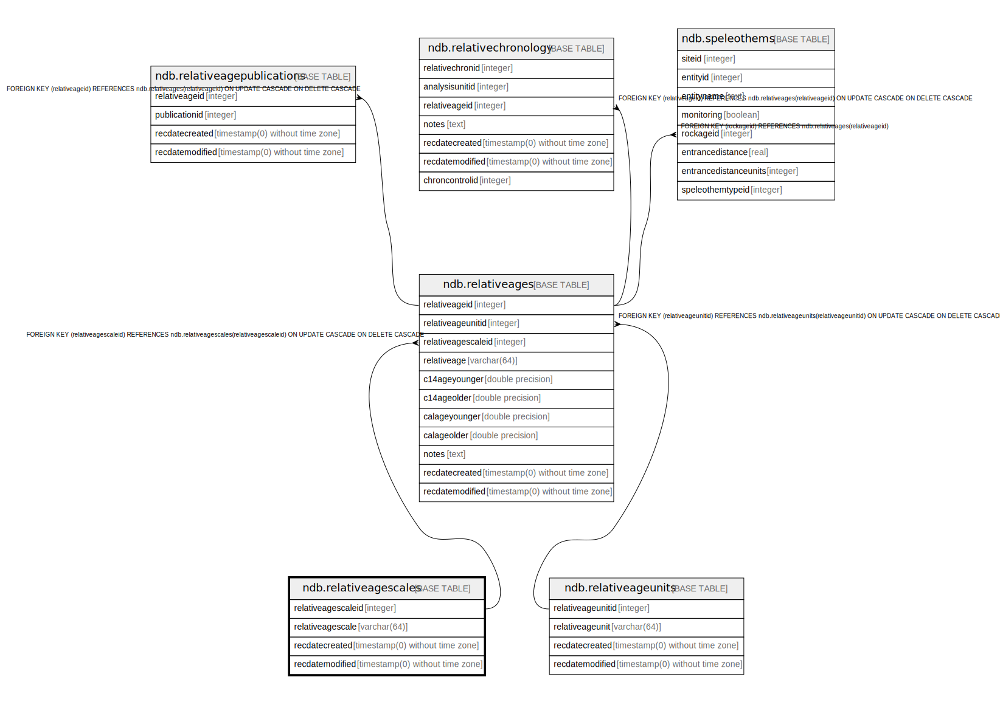

# ndb.relativeagescales

## Description

Lookup table of Relative Age Scales. Table is referenced by the RelativeAges table.

## Columns

| # | Name               | Type                           | Default                                                           | Nullable | Children                                | Parents | Comment                                                                                                                                                                                                                                                           |
| - | ------------------ | ------------------------------ | ----------------------------------------------------------------- | -------- | --------------------------------------- | ------- | ----------------------------------------------------------------------------------------------------------------------------------------------------------------------------------------------------------------------------------------------------------------- |
| 1 | recdatecreated     | timestamp(0) without time zone | timezone('UTC'::text, now())                                      | false    |                                         |         |                                                                                                                                                                                                                                                                   |
| 2 | recdatemodified    | timestamp(0) without time zone |                                                                   | false    |                                         |         |                                                                                                                                                                                                                                                                   |
| 3 | relativeagescale   | varchar(64)                    |                                                                   | false    |                                         |         | Relative Age Scale. The table stores the following Relative Age Scales: Archaeological time scale Geologic time scale Geomagnetic polarity time scale Marine isotope stages North American land mammal ages Quaternary event classification  |
| 4 | relativeagescaleid | integer                        | nextval('ndb.seq_relativeagescales_relativeagescaleid'::regclass) | false    | [ndb.relativeages](ndb.relativeages.md) |         | An arbitrary Relative Age Scale identification number.                                                                                                                                                                                                            |

## Viewpoints

| Name                                        | Definition                                        |
| ------------------------------------------- | ------------------------------------------------- |
| [Chronology related tables](viewpoint-5.md) | Tables related to chronology and age assignments. |

## Constraints

| # | Name                   | Type        | Definition                       |
| - | ---------------------- | ----------- | -------------------------------- |
| 1 | relativeagescales_pkey | PRIMARY KEY | PRIMARY KEY (relativeagescaleid) |

## Indexes

| # | Name                   | Definition                                                                                           |
| - | ---------------------- | ---------------------------------------------------------------------------------------------------- |
| 1 | relativeagescales_pkey | CREATE UNIQUE INDEX relativeagescales_pkey ON ndb.relativeagescales USING btree (relativeagescaleid) |

## Triggers

| # | Name                | Definition                                                                                                                                     |
| - | ------------------- | ---------------------------------------------------------------------------------------------------------------------------------------------- |
| 1 | tr_sites_modifydate | CREATE TRIGGER tr_sites_modifydate BEFORE INSERT OR UPDATE ON ndb.relativeagescales FOR EACH ROW EXECUTE FUNCTION ndb.update_recdatemodified() |

## Relations

---

> Generated by [tbls](https://github.com/k1LoW/tbls)