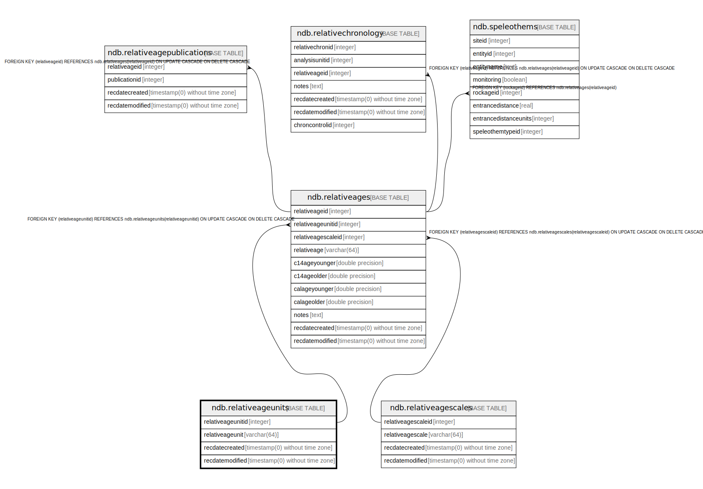

# ndb.relativeageunits

## Description

Lookup table of RelativeAgeUnits. Table is referenced by the RelativeAges table.

## Columns

| # | Name              | Type                           | Default                                                         | Nullable | Children                                | Parents | Comment                                                                                                         |
| - | ----------------- | ------------------------------ | --------------------------------------------------------------- | -------- | --------------------------------------- | ------- | --------------------------------------------------------------------------------------------------------------- |
| 1 | relativeageunitid | integer                        | nextval('ndb.seq_relativeageunits_relativeageunitid'::regclass) | false    | [ndb.relativeages](ndb.relativeages.md) |         | An arbitrary Relative Age Unit identification number.                                                           |
| 2 | relativeageunit   | varchar(64)                    |                                                                 | false    |                                         |         | Relative Age Unit. Below are the Relative Age Units for the «Geologic time scale» with an example Relative Age. |
| 3 | recdatecreated    | timestamp(0) without time zone | timezone('UTC'::text, now())                                    | false    |                                         |         |                                                                                                                 |
| 4 | recdatemodified   | timestamp(0) without time zone |                                                                 | false    |                                         |         |                                                                                                                 |

## Constraints

| # | Name                  | Type        | Definition                      |
| - | --------------------- | ----------- | ------------------------------- |
| 1 | relativeageunits_pkey | PRIMARY KEY | PRIMARY KEY (relativeageunitid) |

## Indexes

| # | Name                  | Definition                                                                                        |
| - | --------------------- | ------------------------------------------------------------------------------------------------- |
| 1 | relativeageunits_pkey | CREATE UNIQUE INDEX relativeageunits_pkey ON ndb.relativeageunits USING btree (relativeageunitid) |

## Triggers

| # | Name                | Definition                                                                                                                                    |
| - | ------------------- | --------------------------------------------------------------------------------------------------------------------------------------------- |
| 1 | tr_sites_modifydate | CREATE TRIGGER tr_sites_modifydate BEFORE INSERT OR UPDATE ON ndb.relativeageunits FOR EACH ROW EXECUTE FUNCTION ndb.update_recdatemodified() |

## Relations

---

> Generated by [tbls](https://github.com/k1LoW/tbls)